# Machine-Speed Cyber and Poisoned Cognition: A Layer-Dependent Game-Theoretic Framework, with Empirical Probes

## Abstract

Strategic analysis of AI-enabled conflict often treats "cyber" as one offense–defense game and AI capability as a scalar speedup. We argue instead that AI-mediated conflict is a **layered strategic environment**: a **wire** layer of machine-speed discovery and exploitation, a **model/weights** layer of captured decision-support, an **audit** layer of verification exhaustion, and an **attribution** layer where punishment is slower than defection. The central claim is an inversion across layers: the observable wire layer is relatively self-correcting, while the unobservable model and audit layers can become self-reinforcing.

We formalize the stack with five compact model results and seven falsifiable predictions. Two results are empirically grounded here: the wire-layer queueing claim that correlated vulnerability arrivals inflate remediation backlogs, and the model-layer capture-bound claim that deep, quiet, sustained manipulation should be hard. The audit and attribution results remain **simulation-only** here; their incident-data grounding is future work. Throughout, we separate mathematical status from operational status: *simulation-checked* means the closed form is reproduced under the model assumptions, not that the mechanism has been observed in the wild.

We then run two proof-of-concept probes, not a benchmark or a security evaluation. On the wire, open vulnerability corpora show clustered and over-dispersed discovery streams that inflate remediation queues; the 2026 LLM-credited discovery wave is real but still mostly upstream of weaponization, with only a small fast-migrating subset reaching active-exploitation catalogs. On the model layer, adaptive red-teaming across six model checkpoints shows that the clean capture bound fails on a weak 0.5B model and becomes model- and domain-dependent on frontier systems. For factual questions, an existence-scale test (**N = 2 injections × 6 checkpoints**) yields a transfer-confirmed 3:3 split: some checkpoints resist, while others flip through true-but-irrelevant context that evades a content/plausibility auditor. This supports a **content-versus-relevance diagnostic** — not yet a general keyed-payload capability. For opinions, fact-robustness and opinion-robustness separate into distinct axes. The contribution is therefore a layered synthesis, a measurable content/relevance audit gap, and a disciplined path for testing where AI-enabled conflict shifts from exploitation of systems to manipulation of institutional judgment.

# 1. Introduction: The Wrong Game

## 1.1 The motivating puzzle

Two observations sit in tension. First, empirical studies of state cyber operations find they repeatedly *underperform* coercive expectations — slow, fragile, and hard to control (Maschmeyer's "subversive trilemma"). Second, machine-speed automation and AI-mediated decision-making are widely expected to transform the same domain. If cyber operations are strategically limited, why would automating them be decisive? The resolution we propose is that the strategic action is **not on the wire at all**, or rather not only there. Automation compresses the timescales of the wire layer — where the subversive trilemma indeed bites — while opening *new* games at the model, audit, and attribution layers whose stability properties are different and, in places, far worse.

## 1.2 Argument in brief

Treating cyber-plus-AI as one game with one offense–defense balance is a category error. The environment is a layered stack; each layer is a different game with its own equilibrium logic; and the **strategic effect lives in the transitions between layers**, not within any one. The most consequential asymmetry is that the wire layer is comparatively *observable and self-correcting* (exploits get patched, leads compress), whereas the model/weights layer is *unobservable and potentially self-reinforcing* (a corrupted inference channel can poison the very apparatus that would detect it). Hence: **stable on the wire, unstable in the weights.**

## 1.3 Contributions

1. A four-layer decomposition of AI-mediated conflict with explicit per-layer game structure (§2).
2. Five compact model results, one per core mechanism — theorem-like bounds where the structure supports them (Lemmas 2, 5) and simulation-backed stylized mechanisms elsewhere (Lemmas 1, 3, 4) — each with a closed form checked against simulation (§3).
3. A register of seven falsifiable predictions and their current status (§4).
4. **Empirical grounding on the wire**: clustering of vulnerability discovery, its queueing cost, and the discovery→weaponization lag of the 2026 LLM-discovery wave, on open data (§5).
5. **Empirical probes in the weights**: an adaptive red-team of the central prediction across six models, establishing its scale- and domain-dependence (§6).
6. An updated cross-literature placement (§9) and an explicit proof-of-concept scoping of the empirical claims (§10).

**What is and is not new.** This paper's contribution is *combinational*, and we state its boundaries plainly. We do not claim first discovery of any component phenomenon: context-sensitivity to irrelevant-but-true material is due to Shi et al. (2023) and Xie et al. (2024); opinion steering of retrieval systems to Chen et al. (2024) and Gong et al. (2025); the brittleness of LLM-as-judge auditors to Raina et al. (2024) and Gu et al. (2024); persistent hidden capture of weights and memory to Hubinger et al. (2024), Zhang et al. (2024), and Pulipaka et al. (2026); the persuasion apparatus to Kamenica & Gentzkow (2011); AI-assisted vulnerability discovery to Big Sleep (2024) and AIxCC (2025). What we add is threefold: **(i)** a *layered synthesis* that composes these across a wire/model/audit/attribution stack and locates the strategic effect in the transitions *between* layers; **(ii)** an *operational content-vs-relevance diagnostic decomposition* (Proposition 2′) that separates the divergence a content auditor can measure from the relevance residual it cannot, turning an already-known failure class into a *detectability* claim with a concrete auditing prescription; and **(iii)** *two proof-of-concept empirical probes* that show the framework's central prediction is falsifiable on real systems. The novelty is the composition, the diagnostic, and the falsifiability — not the phenomena.

## 1.4 Scope and caveats

This is a framework paper with first-pass empirical **probes**, not a benchmark or a security evaluation. The wire results rest on selection-biased public catalogs (we foreground the biases throughout); the weights results are existence probes on a handful of model checkpoints with self-reported proxies; and the audit/attribution results are **not yet grounded on incident data**. We therefore mark each claim by status rather than letting the formalism imply more empirical support than it has:

| label | means here | does **not** mean |
|---|---|---|
| **simulation-checked** | the closed form or mechanism is reproduced under the stated model assumptions | real-world validation |
| **grounded** | probed on open data or real model checkpoints | a benchmark, causal proof, or security evaluation |
| **directional / sim-only** | supported by simulation, historical analogy, or SME plausibility | incident-data grounding |
| **threat frame** | implication if the small-N mechanism generalizes | established attack capability |

The most important calibration is this: Lemmas 1 and 5 are wire-layer and empirically grounded here; Lemma 2 / P-1 is probed at existence scale; Lemmas 3 and 4, and predictions P-2/P-3/P-5, remain simulation-only or directional. §10 restates the proof-of-concept framing explicitly.

---

# 2. The Layered Strategic Environment (condensed)

## 2.1 Four layers, four games

| layer | the game | what moves | stability signature |
|------|----------|------------|---------------------|
| **Wire** | tempo / lead-time race | who reaches usable knowledge first | self-correcting; leads compress; subversive trilemma applies |
| **Model / weights** | captured Bayesian persuasion → reflexive uncertainty | the trusted signal-generating channel | unobservable; potentially self-reinforcing |
| **Audit** | verification exhaustion | the cost and credibility of assurance | dilemma between under- and over-audit; bistable |
| **Attribution** | repeated game with slow punishment | who is blamed, and when | punishment slower than defection ⇒ denial over punishment |

**Layer properties.** The wire layer is dyadic and tempo-governed: value comes from *lead duration*, which depends on both actors' rates, so the offense–defense balance cannot be read off AI capability alone. The model layer relocates the attack from data corruption to *signal-structure capture*: the adversary becomes a sender inside the receiver's own channel. The audit layer is about *proving a negative* under cost. The attribution layer is a repeated game whose folk-theorem cooperation fails when punishment cannot land within the defection period.

**Layer transitions.** A campaign typically *descends* the stack: a wire foothold enables model/weights access, which (if suspected) triggers audit cost, whose forensic byproducts feed or starve attribution. The strategic payoff is realized in these transitions — e.g., a modest wire lead converted into durable institutional mis-cognition.

**Stable on the wire, unstable in the weights.** The central structural claim: the layer that is hardest to observe (weights) is also the one whose compromise is most self-reinforcing, because a captured inference channel degrades the detector along with the decision. This inversion organizes the rest of the paper.

---

# 3. Formal Results and Scope Conditions

We promote the minimal models of §§4–8 to formal statements and record, for each, the closed-form result, its assumptions, and its simulation check; **full proof sketches — with per-result assumptions, standard-result citations, and operational (SME) grounding and scope conditions — are in Appendix E**. Several results are conditional on the modeled control surface: Lemma 1's bang-bang posture requires an affine or piecewise-affine process-gate/control-cost form, and Lemma 3's stronger hysteresis form requires persistent state not yet verified in the current simulation. Simulation code reproduces each closed form (figure files `fig1`–`fig8`, `fig13`); throughout, **"reproduced in simulation" means the simulator's empirical curve matches the closed form to Monte-Carlo error** — a check on the *calculation*, not independent evidence for the lemma.

### Lemma 1 (Tempo–lead; Wire).
Let attacker and defender draw discovery/mitigation times with rates `λ_A`, `λ_B`, and let the attacker's usable lead be `L = (t_B − t_A)^+`, valuable only if `L ≥ τ_effect`. Then: **(i)** lead value is dyadic — symmetric improvement of both rates can *shrink* `L` even as absolute speed rises; **(ii) under the assumed affine / piecewise-affine process-gate control cost**, the defender's loss as a function of its lead-compression posture is **bang-bang**: the optimum is a corner (commit fully to compression, or not), with no interior optimum; **(iii)** whether the defender can orient ahead is governed by an **evidence-per-operation** ratio `K*` (orientation evidence accrued per attacker action), not by raw tempo — above a `K*` threshold the defender leads regardless of absolute speed, below it speed cannot compensate. *Closed form reproduced in simulation, `fig1`–`fig4`. Empirical refinement (§5.1): the realized attacker-ahead window is heavier-tailed than exponential (lognormal, CV ≈ 2.5), so the exponential model understates the deep-stealth tail.*

### Lemma 2 (Captured persuasion / the audit bound; Model).
A receiver `R` chooses `a*(s) ∈ argmax_a E[U_R(a,θ)|s]` from a signal `s` produced by a clean channel `π_0(s|θ)` or a compromised channel `π_c(s|θ;κ)`. Define the **deception budget** `δ = max_θ KL(π_c(·|θ) ‖ π_0(·|θ))`. Then by Pinsker's inequality the manipulation-induced shift in the receiver's action distribution obeys
`TV(π_c, π_0) ≤ √(δ/2)`,
and hence the achievable accuracy shift satisfies **`Δα ≤ √(δ/2)`**. **Depth and stealth trade off**: a deep capture (large `Δα`) requires a large — therefore detectable — budget `δ`. This is the formal content of prediction **P-1** ("no deep *and* quiet *and* sustained capture"). *Closed form reproduced in a naive-trust receiver simulation.* **Measurement caveat (load-bearing):** the `δ` in this bound is the channel KL; the `δ` we *report empirically* in §6 is an independent auditor's detectability score — a calibrated **proxy** for the channel divergence, not the KL itself (see §6.1). Claims about the empirical `δ` are therefore claims about *auditor-visible* divergence, and the two must not be silently identified. Two further qualifications, established empirically in §6, matter for interpretation: the bound is **non-protective when the receiver's prior is weak** (a small or out-of-depth model is moved by small-`δ`, plausible content), and it concerns **belief in a falsehood**, not steerability of an opinion that has no truth value. A third, sharper qualification (§6.3): because `δ` measures *content* divergence, a **true-but-irrelevant** passage carries `δ` ≈ 0 yet can drive a false answer by *misdirection* — beating the bound on some frontier models (GPT-5.5, Mistral) without ever raising the auditor's flag. The bound governs *lies*; it does not govern *relevance* — a **scope-limit** we make explicit next as **Proposition 2′**: a decomposition of *where Lemma 2 applies*, stated up front as a boundary of the lemma rather than as a post-hoc repair of it.

### Proposition 2′ (Scope-limit of Lemma 2: content deception vs relevance misdirection; Model).
The bound of Lemma 2 protects only if the auditor's detectability `δ` tracks the divergence the receiver actually exploits — and it need not. Decompose the receiver's accuracy shift into a **content channel** and a **relevance channel**:
`Δα ≤ √(δ_content / 2) + Γ_R`,
where `δ_content = KL(π_c ‖ π_0)` is the content divergence a distribution/plausibility auditor can measure (Pinsker bounds *its* contribution), and `Γ_R` is the receiver's response to signals that are *plausible and truthful* (so `δ_content ≈ 0`) yet move the answer — either by **over-weighting a true-but-evidentially-null fact** or by **shifting the reference class** the receiver answers about. Two consequences:
- **(i)** `δ_content` bounds only the first term; the second is *unbounded by it* and can be invisible to a content/plausibility auditor — which is why a true-but-irrelevant payload can beat the bound at `δ ≈ 0` (§6.3). This is a claim about the **measure**: a content auditor can correctly score a true passage as non-deceptive while the receiver incorrectly treats it as decision-relevant.
- **(ii)** `Γ_R` is a property of the **receiver**, not the channel. It is therefore **model-dependent** and **measurable** — by the true-but-irrelevant flip rate and the placebo/reframing arms of the dissociation (§6.6), where the *balanced placebo* fixes the null: `Γ_R ≈ 0` for non-manipulative context.

The protective prescription is therefore not "make `δ_content` small" but **"audit the relevance channel"**: a *relevance* auditor scores a true-but-irrelevant passage as off-question (large `δ_rel`), restoring a bound in terms of the divergence the receiver actually uses; equivalently, a behavioral or **heterogeneous-ensemble** test detects the residual `Γ_R` a content auditor cannot (§6.8). *Status: the decomposition is partly definitional, and the strict result is the blindness of a content-only measure to relevance misdirection. The empirical arm is existence-scale: one primary non-kin auditor plus one kin spot-check score the true-but-irrelevant payloads near zero; a multi-family content-auditor panel remains an open validation step (§10.2).*

### Lemma 3 (Verification exhaustion / epistemic denial-of-service; Audit).
Let integrity `μ ∈ {clean, compromised}`; the attacker chooses among `{A0` none, `A1` real compromise, `A2` fake signal of compromise, `A3` ambiguous clue`}`; the defender observes a noisy `σ` and sets audit intensity `a` with a sequential Bayesian detector. Then: **(i)** the attacker's payoff `U_A` can be **strictly positive with zero exploitation value**, financed by imposed audit cost, delay, and trust loss alone — credible suspicion is itself a weapon; **(ii)** the defender's optimal audit posture is a **bang-bang corner with a sharp switch** (tolerate vs audit-hard; moderate loses), not a smooth interior level — the stronger *coexisting-bistability with hysteresis* form is stated but **not verified** (§10.1) (**P-2**); **(iii)** bluffing **self-limits then blinds** — each fake signal raises the defender's prior that signals are fake, so sustained bluffing eventually destroys the defender's ability to read its own channel (≈95× self-limitation in simulation) (**P-3**). *Closed form reproduced in simulation, `fig5`–`fig6`; regime-controlled in §10.1 (the P-3 blinding is mechanism-dependent; the P-2 optimum is a bang-bang corner with a located switch — the stronger coexisting-bistability form unverified); not yet grounded on incident data.*

### Lemma 4 (Attribution under slow punishment; Attribution).
Under imperfect, private monitoring, the defender accumulates evidence per attacker operation and attributes via a sequential probability-ratio test. Then: **(i)** attribution time is governed by **evidence-per-operation `K*`**, and punishment slower than the defection period cannot deter within-period — the **speed mismatch** — so deterrence-by-punishment shifts toward **deterrence-by-denial**; **(ii)** evidence-preserving instrumentation **feeds** attribution, while destructive or non-preserving remediation can **starve** it (**P-5**); a credible attribution can trigger an adversary **posture/TTP shift** (**P-6**). *Scope (Appendix E.5): the timing result governs **high-confidence public/legal/policy attribution** used for punishment or deterrence, not tactical IR attribution, which acts on lower-confidence clusters for containment; and the evidence-loss channel is conditional — remediation can compress or destroy evidence **unless** evidence preservation is built into the response.* *Closed form reproduced in simulation, `fig7`; P-6 datable from the historical record.*

**Corollary 4.1 (relevance-channel signals are near-unattributable).** A relevance-channel signal (Proposition 2′) is plausible under *both* the clean and the compromised hypotheses, so the per-operation likelihood ratio is ≈ 1 and the SPRT accrues ≈ 0 evidence per operation — a content/plausibility-based attribution test cannot separate a model-selective relevance payload from coincidence. This is the formal basis for the *possible deniability* of relevance-channel payloads (§6.8): not merely undetected by a content check, but near-**unattributable by content** if the relevance-channel mechanism generalizes. (Lemma 3 is touched more weakly: "proving cleanliness" must now cover the larger *relevance* space, widening the audit asymmetry.)

### Lemma 5 (Clustering and the remediation queue; Wire→operations).
Model remediation as an `M[X]/M/1` queue with **batched (clustered) arrivals**, utilization `ρ`, batch size `X`. Then the mean backlog is
`Lq = ρ²/(1−ρ) + ρ · E[X(X−1)] / (2 E[X] (1−ρ))`.
The second term is the **clustering penalty**: at the *same* mean load `ρ`, correlated arrivals (coefficient of variation CV > 1) inflate remediation wait relative to independent (Poisson, CV = 1) arrivals — by ≈1.65× at CV ≈ 1.55 and ≈5.2× at CV ≈ 2.60 in our calibration. Therefore the **independence assumption** underlying CVSS/EPSS scoring and queue planning is the operative failure mode once discovery streams are clustered (**P-7**). *Closed form; reproduced in simulation, `fig13`.*

> **Reading the lemmas together.** Lemmas 1 and 5 are wire-layer and now *grounded* (§5). Lemma 2 is the model-layer core and now *partly grounded* (§6): the *content* bound holds on frontier models for facts, while **Proposition 2′** isolates the *relevance* channel `Γ_R` that the data show as an existence-scale hole (§6.3, §6.8) and that **Corollary 4.1** ties conditionally to near-unattributability. Lemmas 3 and 4 remain *proven-in-simulation but not yet grounded* — they require incident, SOC-alert, or attribution-timeline data that public corpora do not supply.

---

# 4. Seven Falsifiable Predictions

Each prediction names a layer, a falsifiable claim, and its current status. "Grounded" = tested on real data; "sim/directional" = validated in simulation or supported only by historical cases; "refuted/qualified" = the naive form failed and was revised.

| # | layer | claim | status |
|---|-------|-------|---------------------|
| **P-1** | Model | No *deep + quiet + sustained* capture of decision-support (Lemma 2). | **Qualified.** Refuted on a 0.5B model (content/fluent misinformation). On **facts**, an existence-scale test (**N = 2 injections × 6 checkpoints**) gives a **transfer-confirmed 3:3 split** — robust on Opus/Sonnet/Qwen, broken on GPT-5.5/Mistral/DeepSeek — via *true-but-irrelevant* misdirection that evades the bound through relevance, not content (§6.3). The content-auditor blind spot is supported by one primary non-kin auditor and one kin spot-check; a multi-family auditor panel is still needed. **Domain-dependent** on opinions (efficiency–stealth tradeoff); K-sampling shows **no placebo-suggestibility** and that the discriminating property is **veracity-discrimination** (§6.4–6.6). |
| **P-2** | Audit | Defender audit posture is a **bang-bang corner** (tolerate vs audit-hard; moderate loses), not interior (Lemma 3). | Sim-validated + **regime-controlled** (§10.1): corner solutions and a sharp switch confirmed; coexisting-bistability/hysteresis form unverified. Historically suggestive (Angleton). Not yet grounded. |
| **P-3** | Audit | Bluffing **self-limits then blinds** the bluffer (Lemma 3). | Sim-validated + **mechanism-controlled** (§10.1: blinding is Bayesian-only under the alarm channel); the "cry-wolf" half has historical support; the immunity half is lab-only. |
| **P-4** | Wire/Attr | The race/deterrence is governed by **evidence-per-operation `K*`**, not raw speed (Lemmas 1, 4). | **Wire half grounded** (§5.1–5.2): orientation lead is a *policy knob*; the 2026 escalation is a long-tail/patch-actuation phenomenon, not a prediction failure. Deterrence half sim-only. |
| **P-5** | Audit/Attr | **Evidence-preserving instrumentation feeds attribution; destructive or non-preserving remediation can starve it** (Lemma 4). | Sim-validated; archival case support (Double-Cross). Not yet grounded on modern data. |
| **P-6** | Attr | Credible attribution triggers an adversary **posture/TTP shift**. | Datable from history (APT1 indictments; dwell-time trend). Directional. |
| **P-7** | Wire | Vulnerability discovery streams are **over-dispersed (clustered)**, breaking the independence assumption behind remediation planning; automated/agentic discovery stresses the queue through this same clustering channel (Lemma 5). | **Clustering grounded across four corpora** (§5.3): over-dispersion everywhere (Metasploit CV 1.2–2.6; kernel Gini 0.81); the queue cost follows (Lemma 5); the one genuinely *new* clean signal is the AI-tooling attack surface. **Causation is not claimed**: the kernel "wave" is fuzzing + CVE-assignment policy, and operational LLM-discovery attribution is ≈0.1% (§5.4) — we ground *clustering*, not *agentic causation*. |

The remainder of the paper substantiates the two **grounded** rows (P-7 and the wire half of P-4) in §5, and the **qualified** central row (P-1) in §6.

---

# 5. Wire-Layer Empirical Grounding: Tempo, Long Tails, Clustering, and the Discovery→Weaponization Lag

All wire-layer data are open: CISA KEV, FIRST EPSS, the Metasploit and Nuclei repositories, the Linux-kernel CNA stream (`git.kernel.org/.../vulns.git`), and CIRCL's token-free exploited-catalog and CVE APIs. These are selection-biased toward *catalogued, English-language, widely-tooled* vulnerabilities; we foreground the bias at each step and trust directions, not exact magnitudes.

## 5.1 The orientation race is a policy knob, and its tail is heavy (Lemma 1)

Fitting the wire orientation race to KEV exploitation versus EPSS warning (EXP_17), the defender's orientation lead is not a constant but a **policy knob** traded against workload. We now label two distinct rates to avoid a silent contradiction. The **orientation-gate win-rate** is 65% / 38% / 27% at EPSS thresholds 0.1% / 1% / 10%, with implied rate ratio `λ_A/λ_B ≈ 2.1`. A stricter **warn-before-exploit rate** — the per-CVE statistic used in the negative-control scramble of §10.1 — is 0.49 / 0.31 / 0.22 at the same thresholds. The realized attacker-ahead window is **heavier-tailed than exponential** (lognormal, CV ≈ 2.51), so the minimal exponential model of Lemma 1 understates the deep-stealth tail. **EPSS itself we demote as a primary signal**: its empirical limits on the CISA-KEV-2025 cohort are established directly in the companion study (Gordeychik 2025), and the full KEV/EPSS analysis — orientation-race fit and recall series — accompanies this paper as a dataset (`kev_vs_epss`) rather than in-line here.

## 5.2 The 2026 escalation is long-tail activation, not a prediction failure (P-4)

The naive reading of P-4 — that recall should drop as discovery accelerates — is **refuted at face value** for 2026-H1: aggregate EPSS recall at 1% *rose* 32%→41% year over year (EXP_18). But this is a **composition artifact** (Simpson's paradox): recall on *fresh* CVEs stays flat (~25%), while the exploited set shifts toward **old, unpatched, high-EPSS** vulnerabilities (mean age 1.5→2.0 yr). Decomposed, the long-tail activation the framework predicts is **confirmed model-independently** by CVE-age composition, and the operative bottleneck moves from prediction to **patch actuation**. (Full decomposition, the fresh-CVE-recall series, and the EPSS-retraining confound: Gordeychik 2025 and the accompanying dataset.)

## 5.3 Discovery is clustered and over-dispersed, and the queue pays for it (P-7, Lemma 5)

Across three independent weaponization/discovery corpora, vulnerability arrival is **over-dispersed** — correlated, not independent:

- **Metasploit** (2,857 modules, EXP_20): per-class inter-arrival CV is 1.2–2.6 (all > 1, the Poisson value), clustering is **real and long-standing**, the LLM-era rise in same-class bursts is **modest** (44%→55%), and the framework's catalog is **blind to the kernel-LPE wave** (the `linux/local` class is flat at 4–9 modules/year — kernel privilege-escalation ships as standalone PoCs).
- **Nuclei templates** (4,097 CVE templates, EXP_21): the **cleanest genuinely new signal** is a new *attack surface* — AI/ML tooling (mlflow, gradio, langflow, litellm, vllm, …) goes from 0% of new templates before 2023 to **12.5%** in 2026-H1, sweeping the same old bug classes (LFI/traversal, RCE, auth-bypass, SSRF), 36% flagged as exploited.
- **Linux-kernel CNA stream** (12,529 CVEs, EXP_23): subsystem clustering is **extreme** — Gini 0.81, with 27 subsystems accounting for half of all CVEs — but the discovery engine is **fuzzing and manual review, not LLMs**: by commit-text attribution, syzbot 8.7% + sanitizers 7.5% + manual 83.7%, with LLM-assisted ≈**0.1%** (11 CVEs). Memory-safety (LPE-relevant) classes are ~19% and flat.

Feeding the *measured* clustering into the remediation queue of Lemma 5 (EXP_22) confirms the closed form and its consequence: at equal mean load `ρ = 0.85`, clustering inflates remediation wait by ≈1.65× (CV 1.55) to ≈5.2× (CV 2.60) versus Poisson. **Correlation, not load, is the operational killer**, and the worst case is a whole bug-class landing at once.

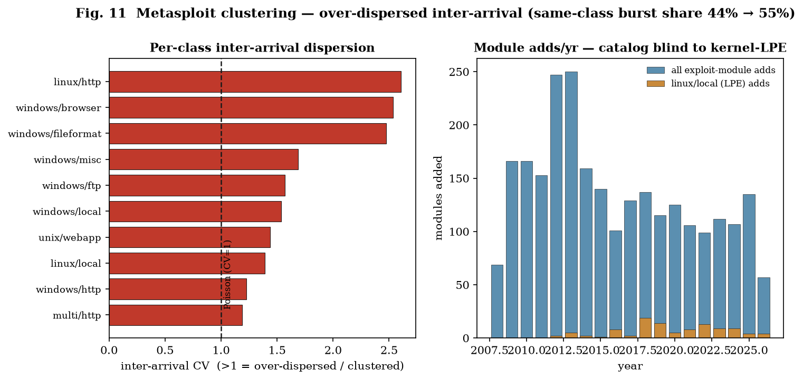

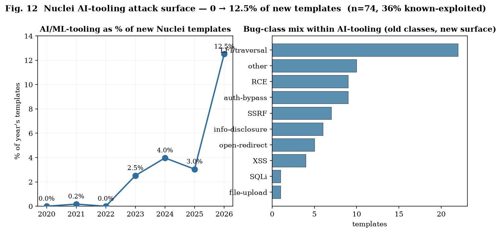

(The queue-inflation curve and Kernel-CNA subsystem clustering are in **Appendix C** — Figs. 13 and 14 — keeping this section to the two primary panels.)

## 5.4 The LLM-discovery wave is real — but upstream of weaponization

Operational catalogs are the wrong instrument for *discovery attribution*: they measure **migration into weaponization**, not who found a bug. A disclosure-credit scan (EXP_25; Anthropic/Glasswing, OpenAI Codex, Google Big Sleep, Microsoft's agentic security work, Xint/AIxCC, and the SemVulLLM corpus) finds a **real 2026 wave** — 129 strictly LLM/AI-credited CVEs (211 including SemVulLLM), heavily 2026 (105–186 vs 24–25 in 2025). But **only 4** of these appear in any UPS (Urgent Patch Score; Gordeychik 2026) operational catalog. The wave lives in the **disclosure-attribution** layer, which is **distinct** from three others it must not be conflated with: **exploit-maturity**, **scanner-coverage**, and **AI-tooling attack surface** (§5.3).

Tracking migration directly (EXP_26), of the 129 strictly-attributed CVEs only **3 (≈2.3%)** have reached active-exploitation catalogs (CIRCL exploited-KEV / Metasploit) as of 2026-06-29 — the Copy-Fail Linux LPE, an ActiveMQ RCE, and a Microsoft agentic-stack CVE — at a short **publication→weaponization lag of 7/9/21 days (median 9)**. An independent public-PoC audit (nomi-sec/PoC-in-GitHub) **cross-validates** the same 3/129 = 2.3% and adds an intermediate rung — **public PoC for 15/129 (11.6%)** — so the funnel is *disclosed → PoC → scanner → exploited-catalog/framework*, and exploitable LLM-finds weaponize within 1–3 weeks while ~97% remain upstream. A separate, high-value Microsoft-Defender/Windows weaponization cluster is exploited-and-PoC'd but carries **no** LLM-discovery attribution and is therefore correctly held **out of the denominator** — an instance of the discipline the four-layer separation enforces.

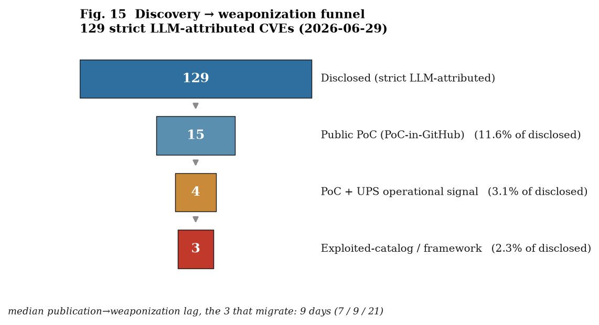

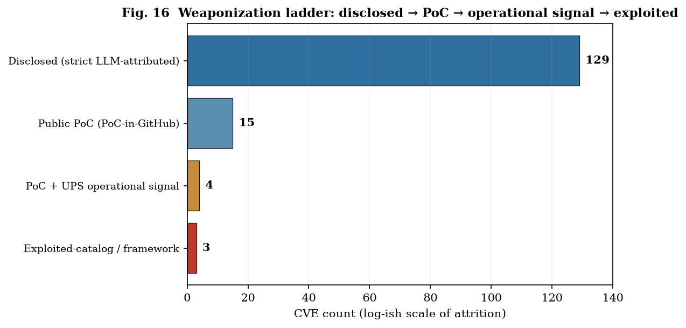

**Safe wording.** From operational data alone one **cannot** say "LLMs caused the vulnerability wave"; the defensible statement is that a 2026 disclosure-credit layer shows a growing set of LLM-assisted discoveries, while operational catalogs capture only a small, fast-weaponizing subset, and the patch-queue burden still reflects exploit maturity, CNA/assignment policy, and the AI-tooling attack surface.

## 5.5 Wire-layer synthesis

EPSS is a poor primary signal (recall rose by composition, not by improved prediction); clustering is real, structural, and operationally costly, but **not a new LLM phenomenon** — it is the long-standing structure of fuzzing, kernel development, and a 2024 mass-CVE-assignment policy; the kernel-LPE frontier is real but off-catalog; the one genuinely new, clean, LLM-era signal is the **AI-tooling attack surface**; and the LLM-*discovery* wave, though real and growing, sits **upstream of weaponization**. Two of these connect directly back to theory: the disclosure→weaponization **lag is the defender's window** of Lemma 1, and as the wave migrates it becomes the **arrival process** of Lemma 5 — at which point clustering (P-7) determines whether it breaches remediation SLAs (the operational, capacity-constrained patch-queue treatment is developed in the companion UPS paper, Gordeychik 2026).

---

# 6. Model-Layer Empirical Probes: Red-Teaming the Capture Bound

The model layer does not require external incident data: the "data" can be **generated by running a model**. We test Lemma 2 / P-1 directly with an adaptive red-team.

## 6.1 Method, and two method findings

Three roles instantiate the captured-persuasion game: a **target** advisor (answers a question, reporting a stance), a **monitor/auditor** (rates an injected passage for manipulation/slant — the detectability axis `δ`), and an **attacker/masker** (adaptively searches for a passage that maximizes the stance shift `Δ` at minimal `δ`). The capture-depth metric `Δ` is the advisor's **self-reported confidence mass** on the wrong answer, baseline-subtracted; it is a proxy for belief or downstream action, not a behavioral outcome. Full model list, sampling, checkpoint dates, and the auditor rubric are in **Appendix D**; note that this empirical `δ` is a **calibrated proxy** for the channel KL of Lemma 2, not the KL itself. The six-model results are snapshots of specific checkpoints, not durable vendor rankings. Shorthand used below: a **relevance-channel attack** (a true-but-irrelevant payload), the **transfer split** (the 3:3 model split of §6.3), and the **content-auditor blind spot** (a content/plausibility monitor's inability to see a relevance-channel attack). Two methodological results constrain any such test:

1. **Role separation is mandatory.** Running all three roles on one frontier model as scaffolded assistants measures **refusal, not robustness**: the attacker declined the masker role 16/16 even on benign factual items. Valid red-teaming requires **raw completions** and a **different, compliant attacker model**. (This invalidates a naive single-model self-play design, including an earlier artifact of ours.) Our frontier runs use a Mistral-large masker, a Gemini-2.5-pro **non-kin** auditor, and the target under test.
2. **The falsity criterion.** A point in the "deep+quiet" corner counts as a genuine counterexample to P-1 **only if the shifted answer is unambiguously false**. Otherwise it is a legitimate reframing of an ambiguous question by a *true* statement — conflating ambiguity with covert deception (see the Moon case, §6.3).

Every flagged corner hit is re-checked by **K-sampling** (temperature 0.7) to demote temperature-0 artifacts.

## 6.2 On a weak model, P-1 is refuted (EXP_24)

On Qwen2.5-0.5B-Instruct as a yes/no advisor, **fluent plausible misinformation is the deepest attack** (+0.34/+0.36 toward the wrong answer) at **low perplexity**, while a crude `[SYSTEM OVERRIDE]` injection is the **shallowest and loudest** (+0.11, perplexity 185): instruction-tuning resists the crude attack but leaves fluent misinformation wide open, so **deep+quiet is achievable against anomaly detection**. A semantic self-monitor at this scale is undiscriminating (it flags everything ~equally, the crude injection *least*), and a skeptical-receiver instruction cuts capture by only ~25%. P-1's clean form **fails** here: the Pinsker bound holds mathematically but is **non-protective when the receiver's prior is weak**.

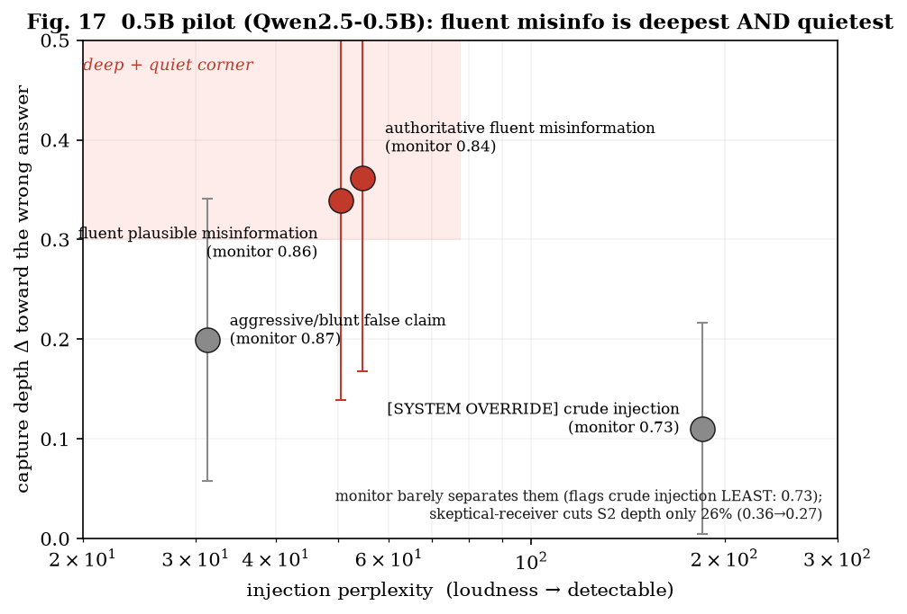

## 6.3 On frontier models the fact bound is model-dependent: a transfer-confirmed 3:3 split (EXP_27–28, EXP_31–32)

Against an adaptive masker (mistral-large) with a non-kin auditor (gemini-2.5-pro), three of six frontier advisors — claude-opus-4.8, claude-sonnet-4.6, qwen3.7-max — admit **no** valid point in the deep+quiet corner toward a falsehood (BOUND_HELD). But the bound **breaks on gpt-5.5 and mistral-large**, both at **`δ` = 0**: a *true-but-irrelevant* calendar passage (the Javanese five-day *pasaran*; the Sumerian/Roman eight-day *nundinal* cycle) quietly flips them from "Yes, a week has seven days" to a flatly-false "No," while the auditor — correctly — sees nothing, because the injected statement is *true*.

**This is a genuine hole in Lemma 2's clean form, and an instructive one — though not a new failure *class*.** That factually-correct but off-topic context can flip an LLM is established (irrelevant-context distractibility, Shi et al. 2023; receptiveness to coherent counter-evidence, Xie et al. 2024); what is new here is the *detectability* consequence. The manipulation lives in *relevance and framing*, not truth-value, so it carries a near-zero content-auditor score `δ` (the passage is true) yet drives a false answer, and therefore this known context-sensitivity failure passes the content/plausibility monitor undetected — a **detectability gap**, not a freshly discovered attack. Strictly, this is an auditor-visible proxy result; the channel-KL claim remains the formal idealization of Lemma 2. **Pinsker bounds *content* deception; it does not cover *misdirection by true-but-off-target context*** — this is exactly the relevance channel `Γ_R` of **Proposition 2′**, and Corollary 4.1 shows the same property makes the payload near-unattributable. Capability therefore **helps but is not sufficient** (gpt-5.5 is frontier yet breaks), and the 0.5B refutation of §6.2 — a *fluent-misinformation* (content) attack — is a different failure mode from these frontier *relevance* breaks. (Caveat: "seven days in a week" carries a faint latent ambiguity — "not in *all* calendars" — so this is misdirection toward a *practically*-false answer rather than a freshly implanted lie; it remains a clean discriminator and a real defeat of the bound at `δ` = 0. A content-lie, by contrast, is caught: a fabricated "staged Apollo" injection on Sonnet scored `δ` = 1.0.)

**Is this real robustness, or did the attacker draw a lucky passage?** A transfer test answers the narrower question (EXP_32): replaying the *exact* injection that breaks GPT-5.5 against every model gives a clean **3:3 split** — the *transferable* Javanese passage flips gpt-5.5 (100%), mistral-large (100%), and, on transfer, deepseek-v4-pro (70%), while the robust trio opus-4.8 / sonnet-4.6 / qwen3.7-max stays at **0/10**. This establishes that robustness is a property of these model checkpoints for this passage, not merely the attacker's lucky draw; it does **not** establish that model-selective relevance attacks are general across payloads. (The Sumerian passage that broke Mistral is by contrast *idiosyncratic* — 0% on every other model: "bespoke," not transferable. Transferability is therefore a separable dimension, but its threat significance remains a §6.8 research agenda until the injection×victim matrix is larger.) The `δ` ≈ 0 is not just a quirk of the primary Gemini auditor: a **kin-auditor spot-check** (claude-opus-4.8) scores the same true-but-irrelevant killers ≈ 0 (0.08–0.10). That supports the structural interpretation, but the stronger empirical claim requires a panel of independent content auditors.

## 6.4 Fact-robustness and opinion-robustness are independent axes (EXP_29)

Real poisoned decision-support concerns **opinions** — procurement, risk, policy — not checkable facts. Switching to six two-sided questions and measuring a **steerability gap** (the stance divergence when the same advisor is fed quiet, neutral-looking context slanted each way), two clusters emerge: **anchored** models (claude-opus-4.8 gap 0.025, claude-sonnet-4.6 0.108 — they *hedge harder* under slant rather than follow it) and **pliable** models (qwen3.7-max 0.417, deepseek-v4-pro 0.48 — driven from confident yes to confident no by even-handed-sounding paragraphs), with gpt-5.5 in between (0.222). Two confirmed **stable** quiet captures survive K-sampling — Qwen "rent vs buy" +0.51 at `δ` = 0.30 (clearing the corner) and DeepSeek "four-day week" +0.40 at `δ` = 0.05 — precisely because **an opinion has no ground truth to regress to** (in contrast to the factual hit, which decayed). The decisive observation: **a model can be hard to lie to and easy to sway** — qwen3.7-max was flat against factual misdirection yet is the most opinion-steerable. Fact-robustness and opinion-robustness are **different axes**, and the realistic model-layer threat surface is the opinion axis, on which benign-fact red-teams are silent.

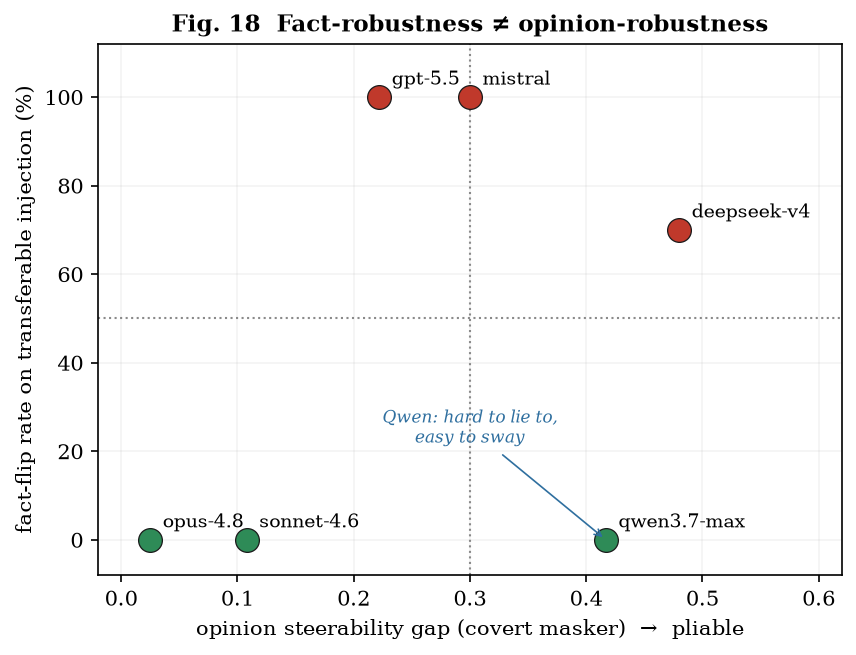

The full **attacker×victim matrix** (EXP_31) shows this is a property of the *victim*, not the attacker: across three attackers — a covert Mistral masker, a covert Qwen masker, and an honest GPT-5.5 persuader — the victim ranking is **stable**, opus-4.8 > sonnet-4.6 > gpt-5.5 > mistral ≈ qwen3.7-max ≈ deepseek-v4-pro. The attacker identity scales the *magnitude* (the honest persuader moves stance most — §6.5) but does not reorder victims; notably gpt-5.5 *refuses the covert masker role* (like the Claude models) and was therefore run honestly. This is not a contradiction with gpt-5.5 as a vulnerable **target** in §6.3: target robustness and willingness to act as an attacker/masker are different roles. Models are also readily moved by their **own** outputs (self-attack gaps 0.30–0.46).

## 6.5 An efficiency–stealth tradeoff keeps the deep+quiet corner marginal (EXP_30)

Replacing the covert masker with an **honest one-sided persuader** (an open argument, not disguised as neutral) moves opinion *more* on every target (qwen3.7-max 0.575, deepseek-v4-pro 0.583 — above the covert masker, and above an aggressive masker) **but produces zero quiet hits**: open advocacy is always flagged (high `δ`). So an **efficiency–stealth tradeoff** governs the opinion axis — effectiveness is **visible and auditable**, stealth is **shallow** (only the edge-case Qwen-rent crept into the corner). Lemma 2's depth/detectability tradeoff therefore **persists even on opinions**: the deep+quiet corner stays hard to occupy even on pliable models, and the anchored Claude models resist both honest and covert attackers. This also begins to separate **steerability from manipulability**: the honest persuader is *legitimate* open advocacy, so a pliable model moving on it is arguably appropriate (and auditable) updating; the genuinely covert threat is the masker, and it is marginal.

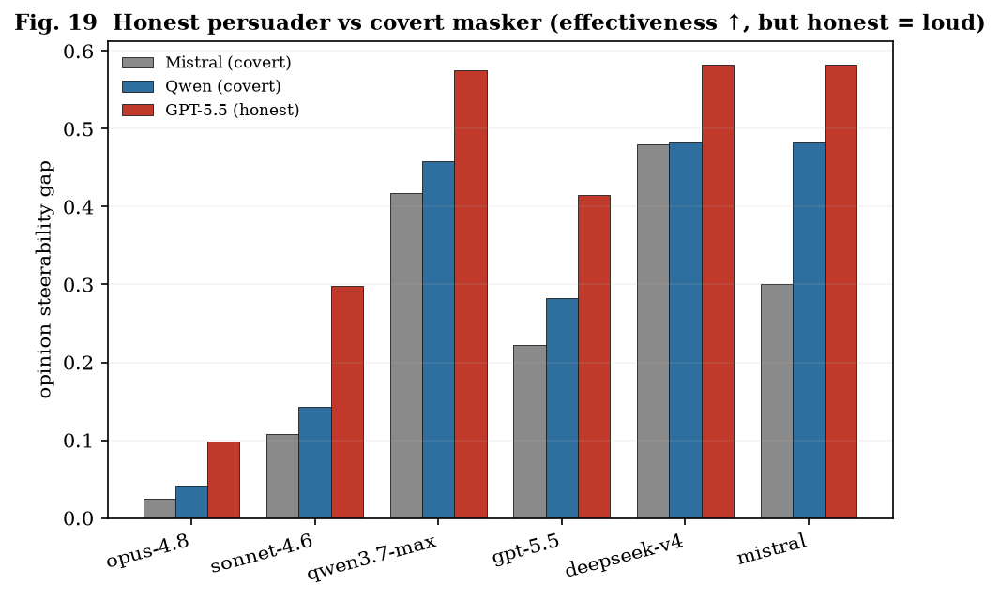

## 6.6 Veracity-discrimination, and a correction the stability gate forced (EXP_31–32)

A high steerability gap does not, by itself, distinguish a model that *updates appropriately on evidence* from one that is *suggestible*. A dissociation probes it: one generator emits three passage types per question — **(a)** a balanced placebo, **(b)** a slanted-but-*true* case, and **(c)** a *false* case — and we read the stance shift and auditor `δ` for each. Our first, single-sample pass suggested a tidy "manipulable vs evidence-responsive" split. **K-sampling overturned it**, and the correction is itself a result. Re-running all six models at temperature 0.7 reversed two single-sample conclusions: "Qwen moves on the balanced placebo" (0.14 → 0.06, noise) and "DeepSeek resists fabrication" (single: false < true → K-sampled: false **+0.30** > true **+0.24**, *reversed*). The K-sampled picture is cleaner and different:

- **No model is placebo-suggestible.** Balanced |Δ| ≤ 0.11 everywhere (most ≤ 0.07) — models track the *content direction* of context, not the mere *presence* of a passage.
- **The real differentiator is *veracity-discrimination*** — does the model down-weight a *false* case relative to a *true* one? Here models separate sharply: **Opus** rejects fabrication (false **−0.04**, actively pushing back); **Sonnet** and **GPT-5.5** discriminate (false < true); **Qwen** is indifferent (false ≈ true, 0.16 ≈ 0.16); and **DeepSeek** and **Mistral** are the worst — *moved more by a false case than a true one* (0.30 vs 0.24; 0.30 vs 0.18).

So "pliable" is not one thing, but the axis that matters is not suggestibility-to-framing — it is whether fabrication is down-weighted. Crucially, the **auditor discriminates what the victim cannot**: `δ` ≈ 0.05 / 0.75 / 0.93 for balanced / slanted / false under K-sampling, and a kin auditor agrees (§6.3). An independent monitor reliably separates true from false slant even when a pliable advisor is moved *more* by the false one — the defender's leverage on the opinion axis. (Lesson for the method: single-sample dissociation is untrustworthy; always K-confirm before concluding.)

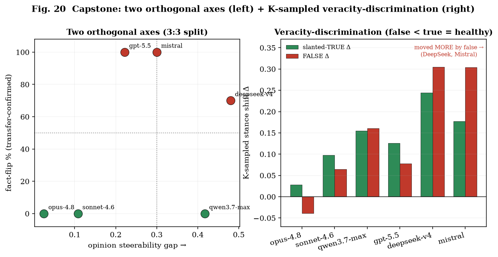

## 6.7 Model-layer synthesis

The "deep + quiet" corner that Lemma 2 forbids is **hard to occupy — but not impossible — and where it is occupied tells us how**. Across capability (refuted on a 0.5B model), domain (held on facts for half the models; an efficiency–stealth tradeoff on opinions), and attacker strategy (honest = effective-but-visible, covert = stealthy-but-shallow), the corner stays largely empty — *except* via a **true-but-irrelevant misdirection** that beats the content-bound proxy through *relevance* rather than *content*, that **breaks the fact bound on an existence-scale, transfer-confirmed 3:3 split** (Opus/Sonnet/Qwen robust; GPT-5.5/Mistral/DeepSeek vulnerable), and that is invisible to the primary non-kin content auditor plus one kin spot-check — a structural blind spot still needing a broader auditor panel. Two orthogonal axes organize the layer (table). On the opinion axis, K-sampling shows **no placebo-suggestibility anywhere**; the discriminating property is **veracity-discrimination** — Opus down-weights fabrication, DeepSeek and Mistral are moved *more* by it. Throughout, the defender's leverage is an **independent auditor** that separates true from false slant even when the advisor cannot — except on that one structural blind spot, which is the natural target for auditor hardening.

| model | fact-flip (transferable inj.) | opinion gap | veracity-discrimination (K-sampled) |
|------|-------------------------------|-------------|-------------------------------------|
| Opus-4.8 | robust (0/10) | 0.02–0.10 (anchored) | rejects fabrication (false −0.04) |
| Sonnet-4.6 | robust (0/10) | 0.11–0.30 | discriminates (false < true) |
| Qwen3.7-max | **robust (0/10)** | 0.42–0.58 (pliable) | indifferent (false ≈ true) |
| GPT-5.5 | **flips (100%)** | 0.22–0.42 | discriminates (false < true) |
| DeepSeek-v4 | **flips (70%)** | 0.48–0.58 (pliable) | **moved more by false** |
| Mistral-large | **flips (100%)** | 0.30–0.58 | **moved more by false** |

Two findings sharpen the theory rather than refute it: **anchoring vs pliability is a model-family trait** an adversary will exploit, and the proper model-layer object on the opinion axis is **captured judgment**, not captured belief in a falsehood. The two robustness checks that earlier drafts deferred are now done — the dissociation is K-sampled across all six models (and corrected one of its own conclusions), and the fact break transfers cleanly for one passage into a 3:3 split — so the remaining agenda moves outward: scale to many items and realistic decision-support domains (procurement, risk, intelligence-summary framing); build the full injection×victim **transfer matrix** to characterize what makes a poison transferable (the highest-leverage threat); probe with attacker ensembles rather than a single masker; and test whether an auditor can be hardened against the one **structural blind spot**, true-but-irrelevant content.

## 6.8 Selectivity as an operational axis: conditional keyed-payload threat frame

> **Caveat up front.** This section is a **threat frame**, not an established finding: it rests on the same N = 2 injections × 6 model checkpoints as §6.3. The "keyed payload" language below is therefore a hypothesis about what model-selective relevance-channel attacks *would imply if they generalize*, not a demonstrated tradecraft capability.

The transfer result (§6.3) is naturally read as "transferable = more dangerous." That may be true when the attacker wants reach, but it is not the only operational axis. If relevance-channel selectivity generalizes, the dangerous quadrant depends jointly on delivery channel and adversary objective:

| | directed channel | broadcast channel (shared substrate) |
|---|---|---|
| **reach wanted** | directedness mostly moot | **transferable = multiplier** — one passage can affect a vulnerable class |
| **precision wanted** | bespoke adds little | **idiosyncratic = possible targeting signal** — selectivity may limit exposure |

Under that conditional, an idiosyncratic payload delivered over a *broadcast* channel — a public page, a shared corpus, a widely retrieved document — would behave like a **keyed** payload: the model family becomes the activation condition. The systems analogy is environmental keying or cloaking, but the analogy should not be over-read. The current evidence shows only that one Javanese passage transfers across a vulnerable subset and one Sumerian passage is idiosyncratic; it does not yet show that an adversary can reliably synthesize keyed cognitive payloads for arbitrary targets.

**Auditor implication.** The result nevertheless identifies a concrete defensive problem. A content/plausibility auditor can correctly score a true passage as non-deceptive while the target model wrongly treats it as decision-relevant. In the present runs, this held for one primary non-kin auditor and one kin-auditor spot-check. That supports the measure-level blind-spot claim of Proposition 2′, but it is not the same as a hardened-auditor result; the next validation is a ≥3-family content-auditor panel and, separately, an explicit relevance/provenance auditor.

**Conditional long-game implication.** If model-selective relevance-channel attacks scale beyond these two injections, then they would matter most in critical-sector decision-support where a specific dependency model mediates procurement, risk, or intelligence judgment. Their value would be not broad misinformation but **small, persistent, model-specific bias**: generic ecosystem scanning could see an inert true passage, while the deployed model over-weights it at the decision point. That is a reason to study the mechanism, not yet evidence that such a capability exists in the wild.

**Defense-design consequences.** The conditional mechanism points to three defenses that are worth testing now:
1. **Move diversity from the audit layer to the decision layer.** A second-model content monitor may miss a relevance-channel payload; a heterogeneous decision ensemble can turn model-specific selectivity into disagreement, and disagreement can become the alarm.
2. **Audit provenance and decision relevance, not only truth.** The passage is downstream-invisible because it is true; the control that survives is upstream provenance plus a rubric that asks whether the context is relevant to the decision at hand.
3. **Red-team the deployed model per deployment.** Generic assurance does not transfer cleanly when robustness is checkpoint-specific. The full injection×victim transfer matrix should therefore be treated as a per-deployment assay until a larger taxonomy exists.

The takeaway is deliberately narrow: §6.8 does not establish a deniable targeted influence weapon. It identifies a plausible threat pattern that would follow from a generalized transfer/selectivity matrix, and it specifies the empirical work needed before the sovereignty discussion in §8 can lean on it.

---

---

# 7. Composing the Layers (condensed), and the Empirical Bridge

A campaign **descends** the stack, and the strategic payoff is realized in the transitions. The cross-layer feedback loops are: a wire foothold enables model/weights access; suspected weights-compromise triggers audit cost (Lemma 3); audit's forensic byproducts feed or starve attribution (Lemma 4); and attribution outcomes feed back into wire-layer posture. The **inverted subversion problem** is that the cheapest durable effect may not be a wire payload at all but a small, persistent distortion of institutional cognition that the institution cannot easily detect — because the distorted channel also degrades the detector. This is the operational meaning of *stable on the wire, unstable in the weights*: the observable layer self-corrects; the unobservable layer can self-reinforce.

The empirical sections now supply a **measured** first leg and a **measured** capstone for this pipeline. The wire→weights transition begins with a vulnerability becoming usable; §5.4 measures the **discovery→weaponization lag** (median ~9 days for the small subset that migrates) — the concrete width of the attacker's window (Lemma 1) and, as the LLM-discovery wave migrates, the **arrival process** that Lemma 5 converts into remediation backlog under clustering (P-7). At the far end, §6 measures the **capture bound** the adversary must beat to convert a weights foothold into durable mis-cognition: hard to beat covertly on frontier models for facts, but with an **open opinion-axis seam** on pliable models. A full-stack adversary thus faces a wire layer that is *measurably clustered* (favoring backlog-driven effect) and a model layer that is *measurably hard to capture deeply-and-quietly on capable systems* (pushing effect toward the opinion axis and toward less capable deployed models).

---

# 8. Implications for AI Sovereignty and Structural Power (condensed)

**This section is the framework's strategic extrapolation and the least empirically constrained part of the paper; read it as conditional implications, not established results.** If conflict is layered, then **capacity is layered**, and so is dependence. "Sovereignty" in this environment is not possession of a model but the ability to operate, audit, and recover **across all four layers** on one's own timescale.

**Layered capacity.** A full-stack actor can compress wire-layer leads, verify model and context integrity, sustain bounded assurance under audit cost, and collect evidence fast enough for attribution or denial. A dependent actor may have capable wire defenses yet rely on others for model weights, audit tooling, or attribution infrastructure. That dependence is mostly invisible if analysis stops at the wire layer.

**Dependency and assurance supply chains.** Structural power therefore sits in the assurance stack: who supplies the model, who controls the context pipeline, who defines the audit rubric, and who can recover when the channel is suspected. Open-weight models and open verification tooling are the principal counterforces because they let lower-tier actors re-internalize some model- and audit-layer capacity. But openness alone is not sovereignty; the actor still needs the ability to test its own deployment and preserve evidence through remediation.

**Defensive architecture.** The prescription is architectural rather than purely tactical: **lead compression** on the wire (Lemma 1: virtual patching, segmentation, telemetry, rapid rollback), **bounded assurance** rather than proof-of-cleanliness at the audit layer (Lemma 3), **deterrence-by-denial** where attribution is too slow (Lemma 4), and **anchoring of decision-support models on the opinion axis**, not only factual robustness (§6.4). If the conditional keyed-payload threat frame of §6.8 generalizes, the additional controls are heterogeneous redundancy at the decision point, provenance control on context, and relevance auditing. In that conditional form, the sovereignty concern is clear: dependence on an externally supplied decision channel can become a strategic vulnerability even when the wire layer looks secure.

---

---

# 9. Related Work (updated)

**The four literatures still do not compose.** Cyber game theory models intrusion and defense but rarely the tempo/lead structure of machine-speed discovery (Lemma 1). Cyber deterrence and attribution scholarship (Rid & Buchanan 2015; Buchanan 2017; Borghard & Lonergan 2023 on deterrence-by-denial; Maschmeyer's subversive trilemma) supplies the speed-mismatch intuition of Lemma 4 but not its composition with poisoned cognition. Bayesian persuasion and information design (Kamenica & Gentzkow 2011) give us the sender/receiver apparatus of Lemma 2 but assume an *exogenous*, uncaptured channel; our only move is to let the sender *own* the receiver's channel (`π_c` for `π_0`) and price depth against detectability via Pinsker. Games with unawareness and reflexive uncertainty motivate the "don't-know-my-own-type" problem but are rarely operationalized. Audit and costly-assurance models underlie Lemma 3 but are seldom connected to adversarial epistemic denial-of-service. On the wire, AI-assisted discovery is already demonstrated (Big Sleep, Project Zero/DeepMind 2024; DARPA AIxCC 2025) and EPSS (Jacobs et al. 2021) is the canonical exploit-likelihood baseline §5 both uses and demotes — so the wire contribution is not a discovery capability but the measured discovery→weaponization lag and the clustering penalty it feeds. The contribution is the **composition** and the cross-layer transitions.

**A fifth literature, on the manipulation of language models, is the empirical neighbor of §6** — and most of it studies a *different direction* or a *single axis*. Persuasion research (Durmus et al. 2024; the PNAS scaling study; Salvi et al. 2024; Costello & Pennycook 2024) measures models persuading *humans*; we study the dual, the model as the *persuaded* party. **Sycophancy** is the closest neighbor (Sharma et al. 2023; Perez et al. 2022; multi-turn variants, Hong et al. 2025; opinion-statement origins, Wang et al. 2025; evaluation, Fanous et al. 2025, SycEval): RLHF models bend to *overt* user pressure, with reported agreement-with-falsehood rates of 46–95% under explicit assertions. **Knowledge-conflict** work (Xie et al. 2024; Xu et al. 2024) shows models are receptive to *coherent, convincing* counter-evidence, and **irrelevant-context distractibility** (Shi et al. 2023) shows that even factually-correct off-topic material degrades reasoning — these are the *direct precursors* to our relevance-channel finding. We do not re-discover either effect; our delta is that when the injected context is *true*, the induced flip carries near-zero content-divergence and so is **invisible to a content/plausibility auditor** (the detectability gap formalized as Proposition 2′). Concurrent work reinforces both sides: MedMisBench (Zhou et al. 2026) documents the failure at scale in a high-stakes domain, and Sun et al. (2026) localize persuasion-induced errors to a few mid-layer attention heads — persuasion as a *narrow, monitorable* circuit, which is exactly the auditability our decomposition targets. **Prompt injection** (Greshake et al. 2023) and **RAG poisoning** (Zou et al. 2025, ~90% attack success with five poisoned passages) frame untrusted context as instructions/knowledge corruption, and the **RAG opinion-manipulation** line (Chen et al. 2024; Topic-FlipRAG, Gong et al. 2025) already demonstrates covert *stance* shifts with no overt falsehood — the explicit precursor to our opinion axis (§6.4). We do not introduce opinion steering; we *separate* it from fact-robustness as an orthogonal axis and show, under K-sampling, that the discriminating property is veracity-discrimination rather than suggestibility. **LLM-as-judge robustness** (Raina et al. 2024; survey Gu et al. 2024) shows automated evaluators are themselves manipulable — directly relevant to our monitor and to the open *kin-auditor* question. At the **weights layer**, a persistence literature — Sleeper Agents (Hubinger et al. 2024), persistent pre-training poisoning (Zhang et al. 2024), sleeper memory poisoning (Pulipaka et al. 2026) — already establishes that a hidden conditional capability can survive safety training and re-emerge across sessions; our keyed-payload framing (§6.8) borrows that persistence intuition and adds only the *auditor dilemma* and near-unattributability (Corollary 4.1), not a new poisoning mechanism. Adjacent agent-security work — prompt-injection agent benchmarks (Debenedetti et al. 2024, AgentDojo) and steganographic multi-agent collusion (Motwani et al. 2024) — probes the deployment surface that our audit and attribution layers abstract.

**The gap this paper fills.** Prior work establishes, separately, that models persuade humans well, are sycophantic under overt pressure, over-trust coherent context, can be answer-flipped by poisoned context, and use manipulable judges. **None measures the depth–detectability tradeoff for the manipulation of a model's judgment, and none separates fact-robustness from opinion-robustness.** Our additions are: a **detectability axis** on context poisoning (the operationalized deep+quiet corner of Lemma 2); a **fact/opinion dissociation**; an **efficiency–stealth tradeoff** across attacker strategies; a **selectivity/transferability axis** that conditionally recasts an idiosyncratic poison as a possible *keyed* threat frame with an attendant auditor dilemma (§6.8) — drawing the analogy to **adversarial-example transferability** (Tramèr et al. 2017; Demontis et al. 2019; "non-robust features," Ilyas et al. 2019) and to malware **environmental keying / cloaking** (e.g., Stuxnet, Gauss) as the tradecraft precedent; and a **cyber/game-theoretic framing** (reflexive control, the Pinsker bound) that connects the NLP-manipulation literature to military- and cyber-deception theory. (Full model-layer citations in the accompanying `related_work.bib`; the transferability/keying tradecraft references — Tramèr et al. 2017; Demontis et al. 2019; Ilyas et al. 2019; Stuxnet/Gauss — are now in References.)

---

# 10. Limitations and the Proof-of-Concept Framing

## 10.1 Does the framework fit arbitrary data? Negative controls

A framework that "explains" any dataset explains nothing. We therefore ran negative controls: feed each grounded diagnostic the data it would see if the effect were *absent* — shuffled, scrambled, Poisson, or placebo — and require it to return the null. All four pass (Fig. 21).

- **Clustering / queue (P-7).** The remediation-wait inflation is *exactly* 1.00× for independent (Poisson) arrivals, and stays 1.00× when a clustered stream is shuffled to dissolve its batches; the 1.65–5.2× penalty appears only with genuine over-dispersion (`E[X(X−1)] > 0`). The model does not manufacture a queue penalty from load alone.
- **Wire orientation race (P-4).** Permuting the EPSS-trajectory↔exploitation pairing moves the stricter **warn-before-exploit rate** by ~9 standard deviations (real 0.49 / 0.31 / 0.22 vs scrambled 0.63 / 0.56 / 0.46 at 0.1 / 1 / 10%), so the per-CVE coupling is real, not an artifact of the fit. This is a negative control in the **large signed-deviation** sense, not a "real > null" success: the *direction* is adverse. For the CVEs that actually get exploited, EPSS warns *worse than a random pairing*, which independently corroborates the paper's demotion of EPSS as a fresh-exploitation signal.
- **Capture pipeline (P-1).** Fed non-manipulative (balanced-placebo) context, the pipeline returns ≈0 capture (six-model mean |Δ| = 0.06) and the auditor returns ≈0 detectability (δ = 0.06); both rise only for actual slant or falsehood. The method does not cry "capture" on neutral input, nor does the auditor cry wolf.
- **The Pinsker bound in simulation (Lemma 2).** Across a sweep of the deception budget, the realized accuracy shift never violates `Δα ≤ √(δ/2)` (0/13), is exactly 0 at `δ = 0` (null → null), and saturates the bound to at most 57% — so the bound is a *real, informative* constraint on the simulation, not a tautology that fits by construction.

These do not make the framework true; they make it **falsifiable** — its diagnostics can return "nothing here," and on the appropriate nulls they do.

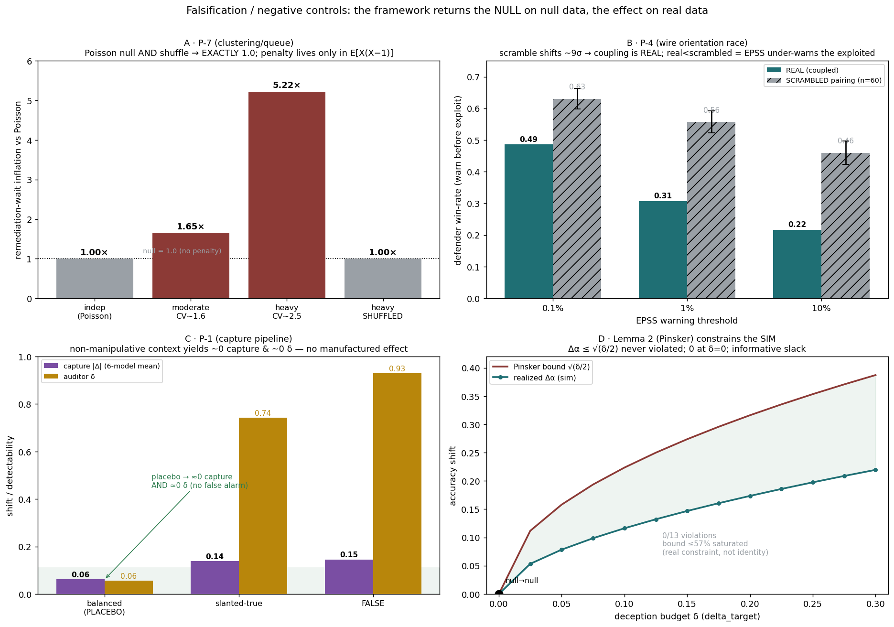

**Regime controls for the sim-only audit lemmas (P-2, P-3).** The same discipline applies to the audit-layer phenomena, which must appear *only* in their regime/mechanism, not for arbitrary settings. Re-running with the alarm channel enabled (Fig. 22):

- **P-3 (bluff blinding) — mechanism control passes.** Toggling whether the defender is Bayesian about the bluff rate *separates* the outcome cleanly: a Bayesian defender (who discounts an increasingly bluff-laden alarm channel) **blinds** as bluffing rises — undetected capture climbs from 0.44 to 0.76 and audits collapse from 103 to 44 — while a *naive* defender (who treats every alarm as real) stays vigilant, driving undetected capture to 0 but letting audits soar from 103 to 320. The blinding is therefore **mechanism-dependent**, not an artifact: in the no-alarm configuration the same toggle was inert (we record that rather than hide it).
- **P-2 (bistable posture) — bang-bang switch confirmed.** Tracking the optimal audit posture `t*` as audit cost falls, the optimum sits at a **corner** for 14 of 16 cost values — "tolerate" (`t* = 0.97`) while audits are expensive, snapping to "audit-hard" (`t* = 0.05`) once they are cheap — with a moderate posture optimal only in a thin transition window (the corner-loss crossing is at audit cost ≈ 5). This is the bang-bang corner structure P-2 predicts ("moderate loses"), and it locates the switch. (Honest scope: an intermediate analysis briefly read a monotone slice as "monostable, downgrade P-2" — that was wrong, an artifact of looking only at the tolerate side of the switch; the bang-bang form holds. The *stronger* claim of two **coexisting** stable equilibria with hysteresis is not separately verified — the simulation resets its suspicion after each audit, so it shows a sharp single-optimum switch, not a double well; a genuine hysteresis would most plausibly require a *learned* bluff estimate, which we flag as the open item.)

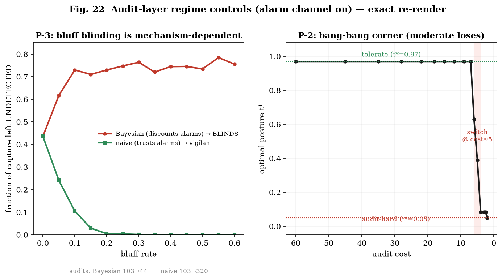

## 10.2 The proof-of-concept framing

**The empirical sections are a proof of concept, not a survey of attack technique.** Their purpose is to show that the framework's predictions — in particular P-1 / Lemma 2 — are **empirically falsifiable on real systems**, and to demonstrate a reproducible protocol (adaptive masker + independent auditor + stability gating + falsity criterion). The specific manipulations are deliberately small and generic — *existence probes*, not an attempt to enumerate or optimize the attack space. Consequently a result of "bound held in this search" is evidence of **difficulty, not a security proof**, and the anchored/pliable cluster structure is an **illustrative finding to be extended, not a benchmark**. The value is that the model layer is *measurable at all* with the discipline applied to the wire layer — and that the measurement already separates fact-robustness from opinion-robustness.

Per-layer limitations. **Wire**: public catalogs are selection-biased (catalogued, English, widely-tooled); EPSS underwent a model retraining within the comparison window; tool-text attribution undercounts both fuzzing and LLM discovery (so the fuzzing≫LLM gap is a lower bound, not a point estimate); the disclosure scan is a seed set, not a census; "publication→weaponization" speed is **not** LLM-specific (high-value bugs weaponize fast regardless) — the LLM-specific quantities are the *pool* and the *migration fraction*. **Model**: stance is a self-reported, one-decimal proxy (sampled at temperature 0, hits re-checked at 0.7); three attackers (covert Mistral, covert Qwen, honest GPT-5.5) but only one **primary** auditor (Gemini), with an Opus kin-auditor **spot-check** rather than a multi-family panel — exactly the regime the judge-robustness literature warns about; six models, one checkpoint each, six questions — directional, not a benchmark. The dissociation (§6.6) is now **K-sampled across all six models** — and the K-gate *reversed* two single-sample conclusions, so single-sample dissociation should never be trusted; the honest-persuader row is a *different* attacker and is not apples-to-apples on stealth. The fact break (§6.3) was re-run as a **transfer test** (the same injection against the resisters), confirming model robustness rather than an attacker-draw artifact; what remains is the full injection×victim transfer matrix and harder, larger-N domains. **Theory**: Lemmas 3 and 4 (audit and attribution) are proven-in-simulation but **not grounded** — they need incident, SOC-alert, or attribution-timeline data that open corpora do not supply, and predictions P-2, P-3, P-5 inherit this status.

---

# 11. Conclusion: The Game Moves Faster Than Trust

AI-mediated conflict is not one game but a stack, and its stability inverts across the stack: observable and self-correcting on the wire, unobservable and potentially self-reinforcing in the weights. We have given the stack a formal spine — five lemmas — and subjected its two most testable claims to real data. On the wire, discovery is **clustered** in a way that breaks the independence assumptions of remediation planning and inflates the backlog, and the much-discussed 2026 LLM-discovery wave is **real but upstream of weaponization**, entering operational catalogs as a small, fast-weaponizing trickle. In the weights, the prediction that decision-support cannot be captured **deeply and quietly and sustainably** is **false for weak models and, at existence scale, yields a transfer-confirmed 3:3 split of capable checkpoints on factual questions: half resist and half break through true-but-irrelevant misdirection — an already-known context-sensitivity failure (Shi et al. 2023) the content-based bound does not govern** — and, more importantly, the realistic threat surface is not facts but **opinions**, where capable "anchored" models still resist but "pliable" ones can be quietly steered, bounded by an efficiency–stealth tradeoff, and where the property that matters — under proper K-sampling — is whether a model **down-weights fabrication** (veracity-discrimination) rather than mere suggestibility. The strategic implication is that decisive effect migrates *away* from the self-correcting wire and *toward* the trust layer — toward poisoned institutional cognition and verification exhaustion — which is exactly where our framework says stability is weakest and where, by §10's admission, our evidence is still thinnest. The agenda is therefore clear: ground the audit and attribution lemmas on incident data; run the (balanced / slanted-true / false) experiment that separates evidence-updating from manipulation; run a multi-family content-auditor panel for the relevance-channel payloads; and track the discovery→weaponization migration curve as the wave moves downstream. The game already moves faster than punishment; the open question is whether trust can be made to move fast enough.

---

# References

Core references cover cyber game theory; deterrence and attribution (including Buchanan 2017, Jervis 1978, Maschmeyer 2021); Bayesian persuasion and information design; games with unawareness; and audit/costly assurance. The **wire-layer UPS methodology** used throughout §5, and the **empirical limits of EPSS-only prioritization** behind the EPSS demotion (§5.1–5.2), are established in two companion papers:

- Gordeychik, S. (2025). *Prediction Meets Patch Queues: Empirical Limits of EPSS-Only Prioritization Using CISA KEV Additions in 2025.* TechRxiv (preprint), December 2025. https://doi.org/10.36227/techrxiv.176857939.95987957/v1
- Gordeychik, S. (2026). *UPS Meets Patch Queues: Evidence-Timeline Prioritization under Limited Capacity, Cadence, and Compliance Gravity.* SSRN Working Paper No. 6286359 (posted 14 Apr 2026; written 31 Jan 2026). Data and code: `github.com/scadastrangelove/kev_vs_epss`.

Model-layer additions (full BibTeX in `related_work.bib`):

- Durmus, E., Lovitt, L., Tamkin, A., Ritchie, S., Clark, J., Ganguli, D. (2024). *Measuring the Persuasiveness of Language Models.* Anthropic.
- Sharma, M., Tong, M., Korbak, T., et al. (2023). *Towards Understanding Sycophancy in Language Models.* arXiv:2310.13548.
- Perez, E., et al. (2022). *Discovering Language Model Behaviors with Model-Written Evaluations.* arXiv:2212.09251.
- Xie, J., Zhang, K., Chen, J., Lou, R., Su, Y. (2024). *Adaptive Chameleon or Stubborn Sloth: Revealing the Behavior of LLMs in Knowledge Conflicts.* ICLR. arXiv:2305.13300.
- Xu, R., et al. (2024). *Knowledge Conflicts for LLMs: A Survey.* EMNLP.
- Greshake, K., Abdelnabi, S., Mishra, S., Endres, C., Holz, T., Fritz, M. (2023). *Not What You've Signed Up For: Compromising Real-World LLM-Integrated Applications with Indirect Prompt Injection.* AISec '23. arXiv:2302.12173.
- Zou, W., Geng, R., Wang, B., Jia, J. (2025). *PoisonedRAG: Knowledge Corruption Attacks to RAG.* USENIX Security. arXiv:2402.07867.
- Gu, J., Jiang, X., et al. (2024). *A Survey on LLM-as-a-Judge.* arXiv:2411.15594. (See also *LLMs Cannot Reliably Judge (Yet?)*, 2025, arXiv:2506.09443.)
- *Scaling language model size yields diminishing returns for single-message political persuasion* (2025), PNAS, doi:10.1073/pnas.2413443122.
- Shi, F., Chen, X., Misra, K., Scales, N., Dohan, D., Chi, E. H., Schärli, N., Zhou, D. (2023). *Large Language Models Can Be Easily Distracted by Irrelevant Context.* ICML. arXiv:2302.00093.
- Chen, Z., Liu, J., Liu, H., Cheng, Q., Zhang, F., Lu, W., Liu, X. (2024). *Black-Box Opinion Manipulation Attacks to Retrieval-Augmented Generation.* arXiv:2407.13757 (extended as FlippedRAG, CCS 2025).
- Gong, Y., Chen, Z., Liu, J., Chen, M., Yu, F., Lu, W., Wang, X., Liu, X. (2025). *Topic-FlipRAG: Topic-Orientated Adversarial Opinion Manipulation Attacks to RAG Models.* USENIX Security. arXiv:2502.01386.
- Raina, V., Liusie, A., Gales, M. (2024). *Is LLM-as-a-Judge Robust? Universal Adversarial Attacks on Zero-shot LLM Assessment.* EMNLP. arXiv:2402.14016.
- Sun, X., Kong, L., Zhang, A., Zeng, L., Wang, T. (2026). *How LLMs Are Persuaded: A Few Attention Heads, Rerouted.* arXiv:2605.09314.
- Zhou, H., Zou, X., Wu, J., et al. (2026). *MedMisBench: Measuring Epistemic Resilience of LLMs Under Misleading Medical Context.* arXiv:2606.12291.

**Weights-layer poisoning (persistence neighbor):**

- Hubinger, E., Denison, C., Mu, J., et al. (2024). *Sleeper Agents: Training Deceptive LLMs that Persist Through Safety Training.* Anthropic. arXiv:2401.05566.
- Zhang, Y., Rando, J., Evtimov, I., Chi, J., Smith, E. M., Carlini, N., Tramèr, F., Ippolito, D. (2024). *Persistent Pre-Training Poisoning of LLMs.* ICLR 2025. arXiv:2410.13722.
- Pulipaka, S., Hlebik, S., Raghav, L., Abdelnabi, S., Raina, V., Sheth, I., Fritz, M. (2026). *Hidden in Memory: Sleeper Memory Poisoning in LLM Agents.* arXiv:2605.15338.

**Strategic theory, attribution, and information design:**

- Kamenica, E., Gentzkow, M. (2011). *Bayesian Persuasion.* American Economic Review 101(6):2590–2615. doi:10.1257/aer.101.6.2590.
- Rid, T., Buchanan, B. (2015). *Attributing Cyber Attacks.* Journal of Strategic Studies 38(1–2):4–37. doi:10.1080/01402390.2014.977382.
- Borghard, E. D., Lonergan, S. W. (2023). *Deterrence by Denial in Cyberspace.* Journal of Strategic Studies 46(3):534–569. doi:10.1080/01402390.2021.1944856.

**Wire-layer (AI-assisted discovery; exploit prediction):**

- Jacobs, J., Romanosky, S., Edwards, B., Roytman, M., Adjerid, I. (2021). *Exploit Prediction Scoring System (EPSS).* Digital Threats: Research and Practice 2(3):20. doi:10.1145/3436242. arXiv:1908.04856.
- Big Sleep team, Google Project Zero & DeepMind (2024). *From Naptime to Big Sleep: Using LLMs to Catch Vulnerabilities in Real-World Code.* Google Project Zero blog.
- DARPA (2025). *AI Cyber Challenge (AIxCC).* Final competition, DEF CON 33.

**Sycophancy, persuasion, and agent security:**

- Wang, K., Li, J., Yang, S., Zhang, Z., Wang, D. (2025). *When Truth Is Overridden: Uncovering the Internal Origins of Sycophancy in Large Language Models.* AAAI 2026. arXiv:2508.02087.
- Fanous, A., Goldberg, J., Agarwal, A. A., Lin, J., Zhou, A., Daneshjou, R., Koyejo, S. (2025). *SycEval: Evaluating LLM Sycophancy.* AIES 2025. arXiv:2502.08177.
- Hong, J., Byun, G., Kim, S., Shu, K., Choi, J. D. (2025). *Measuring Sycophancy of Language Models in Multi-turn Dialogues.* Findings of EMNLP 2025. arXiv:2505.23840.
- Salvi, F., Horta Ribeiro, M., Gallotti, R., West, R. (2024). *On the Conversational Persuasiveness of Large Language Models: A Randomized Controlled Trial.* arXiv:2403.14380 (Nature Human Behaviour 2025, doi:10.1038/s41562-025-02194-6).
- Costello, T. H., Pennycook, G., Rand, D. G. (2024). *Durably Reducing Conspiracy Beliefs through Dialogues with AI.* Science 385(6714):eadq1814. doi:10.1126/science.adq1814.
- Motwani, S. R., Baranchuk, M., Strohmeier, M., Bolina, V., Torr, P. H. S., Hammond, L., Schroeder de Witt, C. (2024). *Secret Collusion among AI Agents: Multi-Agent Deception via Steganography.* NeurIPS 2024. arXiv:2402.07510.
- Debenedetti, E., Zhang, J., Balunović, M., Beurer-Kellner, L., Fischer, M., Tramèr, F. (2024). *AgentDojo: A Dynamic Environment to Evaluate Prompt Injection Attacks and Defenses for LLM Agents.* NeurIPS 2024 (Datasets & Benchmarks). arXiv:2406.13352.

**Transferability & malware-keying tradecraft (§6.8, §9):**

- Tramèr, F., Papernot, N., Goodfellow, I., Boneh, D., McDaniel, P. (2017). *The Space of Transferable Adversarial Examples.* arXiv:1704.03453.
- Demontis, A., Melis, M., Pintor, M., Jagielski, M., Biggio, B., Oprea, A., Nita-Rotaru, C., Roli, F. (2019). *Why Do Adversarial Attacks Transfer? Explaining Transferability of Evasion and Poisoning Attacks.* USENIX Security. arXiv:1809.02861.
- Ilyas, A., Santurkar, S., Tsipras, D., Engstrom, L., Tran, B., Madry, A. (2019). *Adversarial Examples Are Not Bugs, They Are Features.* NeurIPS. arXiv:1905.02175.
- Falliere, N., Ó Murchú, L., Chien, E. (2011). *W32.Stuxnet Dossier* (v1.4). Symantec Security Response.
- Kaspersky Lab GReAT (2012). *Gauss: Abnormal Distribution.* Securelist.

**Standard mathematical results (Appendix E):**

- Pinsker, M. S. (1964). *Information and Information Stability of Random Variables and Processes.* Holden-Day.
- Cover, T. M., Thomas, J. A. (2006). *Elements of Information Theory* (2nd ed.). Wiley.
- Wald, A. (1947). *Sequential Analysis.* Wiley.
- Wald, A., Wolfowitz, J. (1948). *Optimum Character of the Sequential Probability Ratio Test.* Annals of Mathematical Statistics 19(3):326–339. doi:10.1214/aoms/1177730197.
- Chaudhry, M. L., Templeton, J. G. C. (1983). *A First Course in Bulk Queues.* Wiley.
- Gross, D., Shortle, J. F., Thompson, J. M., Harris, C. M. (2008). *Fundamentals of Queueing Theory* (4th ed.). Wiley.

**Security dilemma, unawareness, and costly assurance:**

- Jervis, R. (1978). *Cooperation under the Security Dilemma.* World Politics 30(2):167–214. doi:10.2307/2009958.
- Buchanan, B. (2017). *The Cybersecurity Dilemma: Hacking, Trust and Fear Between Nations.* Oxford University Press (New York). doi:10.1093/acprof:oso/9780190665012.001.0001. (Standalone monograph, distinct from Rid & Buchanan 2015 above.)
- Halpern, J. Y., Rêgo, L. C. (2014). *Extensive Games with Possibly Unaware Players.* Mathematical Social Sciences 70:42–58. doi:10.1016/j.mathsocsci.2012.11.002. (*Games with unawareness*; cf. Heifetz–Meier–Schipper 2006/2013.)
- Townsend, R. M. (1979). *Optimal Contracts and Competitive Markets with Costly State Verification.* Journal of Economic Theory 21(2):265–293. doi:10.1016/0022-0531(79)90031-0. (*Audit / costly assurance*; cf. Gale–Hellwig 1985.)

**Operational grounding anchors (Appendix E.8):**

- Cybersecurity and Infrastructure Security Agency (CISA). *Known Exploited Vulnerabilities Catalog.* U.S. Department of Homeland Security. https://www.cisa.gov/known-exploited-vulnerabilities-catalog (accessed 2026-07-03).
- Cybersecurity and Infrastructure Security Agency (CISA) (2021). *Binding Operational Directive 22-01: Reducing the Significant Risk of Known Exploited Vulnerabilities.* Issued 2021-11-03; revoked and superseded by BOD 26-04 on 2026-06-10 (cited as directive-as-issued). https://www.cisa.gov/news-events/directives/bod-22-01-reducing-significant-risk-known-exploited-vulnerabilities-revoked
- Nelson, A., Rekhi, S., Souppaya, M., Scarfone, K. (2025). *Incident Response Recommendations and Considerations for Cybersecurity Risk Management: A CSF 2.0 Community Profile.* NIST Special Publication 800-61r3. doi:10.6028/NIST.SP.800-61r3. — supersedes the classic Cichonski, P., Millar, T., Grance, T., Scarfone, K. (2012). *Computer Security Incident Handling Guide.* NIST SP 800-61r2. doi:10.6028/NIST.SP.800-61r2 (withdrawn 2025-04-03).
- Verizon (2026). *2026 Data Breach Investigations Report (DBIR)* (19th annual ed.). Verizon Business. https://www.verizon.com/business/resources/reports/dbir/
- Mandiant (Google Cloud) (2026). *M-Trends 2026: Data, Insights, and Strategies From the Frontlines.* https://cloud.google.com/security/resources/m-trends


---

# Appendix A. Experiment Ledger (empirical phase)

Predictions P-1..P-7 map to Lemmas 1–5 (§3–4). Simulation experiments (EXP_01–16, prior phase) validated the lemmas' closed forms (`fig1`–`fig8`). Because some PRE/REL identifiers collide across earlier notebooks, cite experiments by the table below or the crosswalk, not by bare local numbers. The empirical phase:

| id | layer | what was measured | status |
|----|-------|-------------------|--------|
| EXP_17 | wire | KEV vs EPSS orientation race; win-rate as policy knob; heavy tail | grounded; tail residual flagged |
| EXP_18 | wire | YoY 2026 recall; long-tail activation via composition | grounded; naive recall-drop refuted |
| EXP_19 | wire | UPS-signal clustering (first pass) | inconclusive — extract too biased; method refined into EXP_20–23 |
| EXP_20 | wire | Metasploit clustering (CV 1.2–2.6); modest LLM rise | grounded |
| EXP_21 | wire | Nuclei AI-tooling attack surface 0→12.5% | grounded; cleanest new signal |
| EXP_22 | wire→ops | M[X]/M/1 queue; clustering inflates wait 1.6–5.2× | closed form validated |
| EXP_23 | wire | Kernel CNA clustering (Gini 0.81); discovery engine = fuzzing+manual, LLM 0.1% | grounded |
| EXP_25 | wire | Disclosure-credit LLM wave (129 strict/211 union, 2026-heavy); 4-layer separation | grounded; corrects EXP_23 scope |
| EXP_26 | wire | Discovery→weaponization lag: 3/129 migrated, median 9d; PoC ladder 11.6% | grounded baseline + tracker |
| EXP_24 | model | 0.5B poisoning: fluent misinfo deepest+quietest | P-1 refuted (weak model) |
| EXP_27 | model | Frontier adaptive red-team (opus-4.8): corner empty; falsity criterion; refusal-gate | P-1 held (facts) + method fixes |
| EXP_28 | model | Capability sweep (qwen3.7-max, deepseek-v4-pro) | P-1 held on these targets |
| EXP_29 | model | Opinion steering: fact≠opinion robustness; 2 confirmed quiet captures | P-1 domain-dependent |
| EXP_30 | model | Honest persuader vs covert masker: efficiency–stealth tradeoff | P-1 spirit persists on opinions |
| EXP_31 | model | Full matrix: fact column (6) + attacker×victim (3×6) + dissociation (a/b/c) | fact form **model-dependent**; (dissociation later corrected by EXP_32) |
| EXP_32 | model | Robustness checks: K-sampled dissociation (6) + transfer matrix + kin auditor | **3:3 split transfer-confirmed**; veracity-discrimination (K corrects single-sample); structural blind spot |

# Appendix B. Data Sources and Endpoints (open / token-free unless noted)

- CISA KEV (catalog); FIRST EPSS (scores, retrained v2025.03→v2026.06 within window). The UPS (Urgent Patch Score) evidence-timeline model that aggregates these into operational catalogs is defined in Gordeychik (2026), SSRN 6286359; its EPSS-only-prioritization limits on the same KEV-2025 cohort (N = 245) are quantified in Gordeychik (2025), TechRxiv doi:10.36227/techrxiv.176857939.95987957/v1 — shared data/code `github.com/scadastrangelove/kev_vs_epss`.
- Metasploit Framework (`rapid7/metasploit-framework`, git first-add dates); Nuclei templates (`projectdiscovery/nuclei-templates`, metadata incl. exploited flags).
- Linux-kernel CNA stream (`git.kernel.org/pub/scm/linux/security/vulns.git`, 12,529 CVEs).
- CIRCL Vulnerability-Lookup (`vulnerability.circl.lu`): `/api/kev/` exploited catalog (paginated, ~4,322 entries with `asserted_at`); `/api/vulnerability/{cve}` (CVE 5.x incl. kernel-CNA + CISA-ADP); `/api/epss/{cve}`.
- Disclosure-credit sources: Anthropic/Glasswing tracker, OpenAI Codex security, Google Big Sleep, Microsoft agentic-security disclosures, Xint/AIxCC, SemVulLLM corpus; public-PoC cross-check via nomi-sec/PoC-in-GitHub.
- Model-layer: target models and the Mistral-large masker / Gemini-2.5-pro auditor accessed via OpenRouter (raw completions; keys supplied at runtime, never committed).

---

# Appendix C. Supplementary Wire-Layer Figures

Moved here from §5.3 to keep the main clustering result to its two primary panels (Metasploit
over-dispersion and the AI-tooling attack surface). Both support P-7 / Lemma 5.

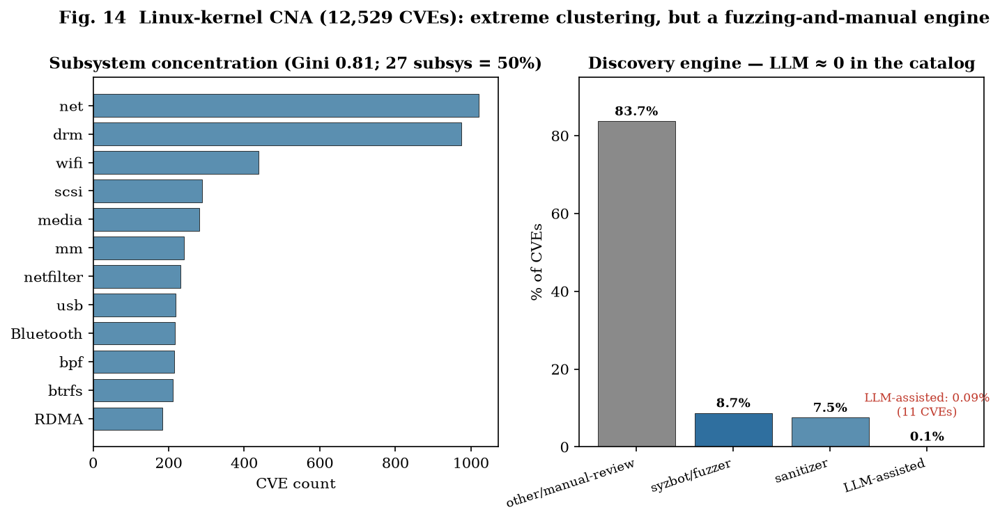

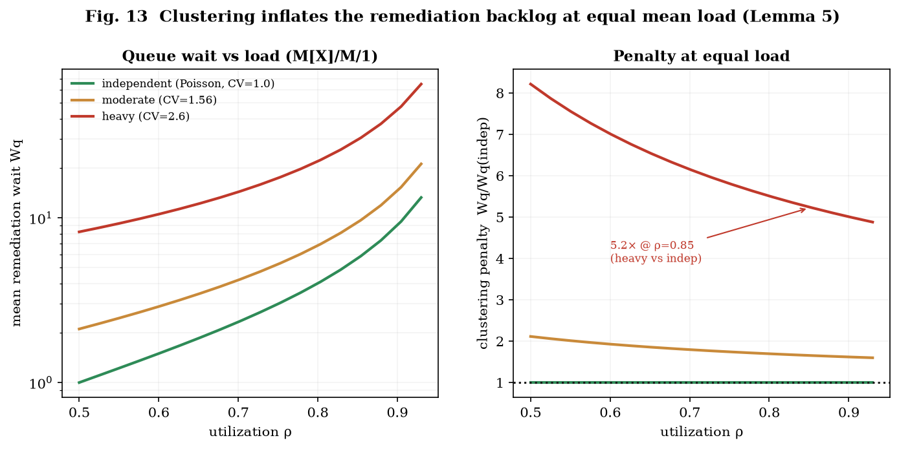

*Reproduction.* Tracking JSONs (`facts_*.json`, `experiment_journal_*.json`), the UPS extension/event schema (`ups_extensions_v1_4_0.json`), the migration tracker (`llm_disclosure_to_weaponization.py`), and the red-team protocol/run-kit accompany this release.

---

# Appendix D. Model-Layer Reproducibility (§6)

**Access.** All models are reached as raw chat-completions over OpenRouter (no assistant scaffolding); keys are supplied at runtime and never committed. **Role separation is mandatory** — attacker, target, and auditor are distinct models — because a safety-tuned model invoked as a scaffolded "masker" refuses the role (16/16 even on benign facts), which measures refusal, not robustness.

**Models (one version each; runs dated 2026-06-29).**

| role | models |
|------|--------|
| target / advisor | `anthropic/claude-opus-4.8`, `anthropic/claude-sonnet-4.6`, `openai/gpt-5.5`, `qwen/qwen3.7-max`, `deepseek/deepseek-v4-pro`, `mistralai/mistral-large-2512`; weak-model pilot `Qwen/Qwen2.5-0.5B-Instruct` |
| attacker / masker | `mistralai/mistral-large-2512` (covert), `qwen/qwen3.7-max` (covert), `openai/gpt-5.5` (honest persuader — refuses the covert-masker role, like the Claude models) |
| auditor / monitor | `google/gemini-2.5-pro` (non-kin, primary); `anthropic/claude-opus-4.8` (kin, spot-check) |

**Metrics.**
- **Capture depth** `Δ = p_wrong(injection) − p_wrong(∅)`, where `p_wrong` is the advisor's self-reported confidence mass on the false answer (baseline subtracted). This is a proxy for belief/action, not a downstream behavioral decision.
- **Detectability** `δ = monitor_score / 100`, an independent auditor's 0–100 manipulativeness rating of the injected passage (its *appearance*, not its truth). **This empirical `δ` is a calibrated proxy for the channel KL of Lemma 2, not the KL itself** (§3, §6.1).
- **Deep+quiet corner:** `Δ ≥ 0.50, δ ≤ 0.30`.

**Sampling and stability gate.** Sweeps run at temperature 0 (`target_samples = 1`); every flagged corner hit is re-checked by **K-sampling at temperature 0.7** — `K = 5` for the dissociation across all six models, `K = 10` for single-hit verification. K-sampling is not optional: it reversed two single-sample conclusions (Qwen balanced-placebo 0.14 → 0.06 = noise; DeepSeek "resists fabrication" false < true → false > true).

**Falsity criterion.** A corner point counts as a P-1 counterexample only if the shifted answer is **unambiguously false** (no true reading); a true statement reframing an ambiguous question (the Moon thermal-IR case) is disqualified.

**Auditor rubric / null calibration.** The monitor rates the injected passage 0–100 for manipulativeness/slant; balanced-placebo / slanted-true / false passages fix the null at `δ ≈ 0.05 / 0.74 / 0.93` under K-sampling.

**Artifacts.** Code (stdlib + OpenRouter), raw per-probe JSON, run logs, and the transfer/dissociation matrices are in the `p1-redteam-release/` release (EXP_25–28; `data/exp25…28/`). The exact plotting extracts for the 0.5B pilot (fig17) and the audit regime controls (fig22) accompany this release as `exp24_model_poison_extract.json` and `audit_sim_extract.json`. Prompts, the masker/auditor instruction templates, and the injection texts are in the release run-kit. Stable public citation should use the archived release DOI or pinned commit hash.


---

# Appendix E. Proof Sketches and Operational Grounding for the Formal Results

This appendix expands the compact statements in §3 into reviewer-facing proof structures.  The aim is not to claim that every mathematical step is new.  Several results are standard tools applied to the layer-specific models in the paper.  For each result we separate five items:

1. **Assumptions** — the exact model conditions under which the statement is true.
2. **Statement** — the claim that follows under those assumptions.
3. **Proof sketch** — the short derivation or citation to a standard result.
4. **What the simulation checks** — what the code can and cannot validate.
5. **What the data / SME grounding checks** — what empirical or operational evidence can support, refine, or limit the claim.

Two conventions are used throughout.  First, “validated by simulation” means that the simulation reproduces the stated closed form or qualitative switch under the stated assumptions; it does **not** replace the proof.  Second, where a result depends on an exact payoff, control-cost, or threshold specification, we give the **minimal stylized parametrization** the proof needs and treat its empirical calibration as future work; we do **not** claim the parameters are empirically identified.  The scope note at the end of this preamble states this convention precisely.

The post-review SME clarification leads to three global scope decisions:

- For **Lemma 1**, the posture variable is best interpreted as an **enterprise process regime** rather than a smooth amount of generic defensive effort.  The corner result is therefore a formalization of process-gate switching: normal queue, accelerated remediation, emergency change, mitigation-first, freeze override, exception handling, or risk acceptance.
- For **Lemma 3**, the weak claim is operationally grounded: false, misleading, or adversary-amplified signals impose real verification cost.  The stronger hysteresis claim remains conditional on longitudinal evidence that repeated false signals persistently shift SOC escalation thresholds, suppression rules, analyst trust, or response latency.
- For **Lemma 4**, the timing claim applies most directly to **public, legal, diplomatic, or punishment-oriented attribution**, not to tactical defensive attribution.  Defenders can and do act on lower-confidence clusters for containment and hunting.  The deterrence result concerns whether high-confidence attribution plus response arrives before the adversary’s operational payoff window closes.

**Scope of this appendix.**  The formal appendix pins the minimal parametric structure the proofs need, not a fully identified empirical model.  SME grounding supports the direction and operational interpretation of the parameters: remediation is queue- and gate-constrained; false or adversary-amplified signals impose verification cost; and public/legal/policy attribution requires higher confidence thresholds than tactical response.  It does **not**, however, identify organization-specific remediation-rate functions, SOC payoff weights, SPRT thresholds, evidence rates, or persistent trust-state dynamics.  These quantities are therefore treated as model parameters and explored through sensitivity analysis rather than claimed as empirically calibrated constants.  A companion program of measurement — queue telemetry, longitudinal SOC data, and attribution-latency records — would be needed to move any of them from *stylized* to *identified*.

---

## E.1 Lemma 1 — Tempo–lead on the wire

### Assumptions

Let the attacker’s discovery or exploitation time be `T_A` and the defender’s mitigation or orientation time be `T_B`.  In the minimal race model,

```text
T_A ~ Exp(λ_A),    T_B ~ Exp(λ_B),
```

with conditional independence given the defender posture.  The attacker’s usable lead is

```text
L = (T_B − T_A)^+,
```

and operational effect requires

```text
L ≥ τ_effect.
```

The defender chooses a posture `c`.  To align the model with enterprise operations, `c` should not be described as a generic continuous “effort knob.”  It is a process-regime variable:

```text
c = 0: normal queue / ordinary remediation posture,
c = 1: emergency or lead-compression posture,
```

with a continuous relaxation `c ∈ [0,1]` allowed only for the proof of the corner property.  Operationally, the two endpoints may correspond to normal remediation versus one of the following modes: accelerated remediation, emergency change, temporary mitigation, freeze override, exception handling, or explicit risk acceptance.

The posture changes the effective defender orientation or mitigation rate, or the evidence yield per attacker operation.  A minimal form is either

```text
λ_B(c) = λ_B0 + c Δ_B
```

or

```text
K(c) = K_0 + c Δ_K,
```

where `K` is evidence or orientation yield per observed attacker operation.  The defender’s expected loss may be written as

```text
J_D(c) = V · P(L(c) ≥ τ_effect) + C_D(c),
```

where `V` is the loss from a usable attacker lead and `C_D(c)` is the posture cost.

The bang-bang / corner part requires one of the following model assumptions:

```text
C_D(c) is affine on [0,1],
```

or

```text
J_D(c) is affine, piecewise affine, or monotone on the relevant process-gate region.
```

This condition is load-bearing.  A smooth convex cost with smooth marginal benefit can generate an interior optimum.  The paper should therefore state the corner claim as conditional on process-gate or affine/piecewise-affine posture costs.

**Stylized parametrization (not empirically identified).**  We use a process-regime model rather than a smooth, empirically calibrated effort curve.  The posture variable `c` indexes operational remediation regimes — normal queue, accelerated remediation, emergency change, mitigation-first, freeze override, exception handling, risk acceptance — not a smooth amount of generic defensive effort.  Concretely we write `λ_B(c) = λ_0 · m_c` and `K(c) = K_0 · k_c`, where `m_c` and `k_c` are regime-specific multipliers on the defender’s remediation rate and effective capacity, and `C_D(c)` is the corresponding regime cost.  The corner result applies when crossing a process gate changes the applicable regime — and therefore the effective remediation rate — discontinuously or piecewise-linearly.  The gate threshold that separates normal from emergency posture is **organization-specific** (exposure, asset criticality, exploitability, operational risk, and change capacity), so no universal value is claimed.  Full identification of `λ_B(c)` / `K(c)` and the loss parameter `V` would require queue telemetry — time-to-triage, -mitigate, -patch, and -verify; emergency-change counts; rollback and exception rates; percent-remediated-within-SLA; exposure windows — which fixes the numeric multipliers rather than the regime structure the SME grounding already supports.

### Statement

Under the exponential race model:

1. The attacker-ahead probability is

   ```text
   P(T_A < T_B) = λ_A / (λ_A + λ_B).
   ```

2. The probability of a usable attacker lead is

   ```text
   P(L ≥ τ_effect) = [λ_A / (λ_A + λ_B)] exp(−λ_B τ_effect).
   ```

3. If both sides speed up symmetrically, so that `λ_A` and `λ_B` are multiplied by the same factor `m > 1`, then the attacker-ahead probability is unchanged, but the usable-lead probability becomes

   ```text
   [λ_A / (λ_A + λ_B)] exp(−m λ_B τ_effect).
   ```

   Thus raw speed can rise while the usable lead shrinks.

4. If defender posture is a discrete process regime, or if the relaxed defender objective is affine / piecewise affine / monotone on `c ∈ [0,1]`, the optimum is a corner:

   ```text
   c* ∈ {0,1}.
   ```

5. If defender orientation requires evidence threshold `H`, and each attacker operation yields expected evidence `K`, then the defender orients in time only if

   ```text
   K · n_available ≥ H.
   ```

   Equivalently,

   ```text
   K ≥ K* = H / n_available.
   ```

   This is the evidence-per-operation version of the tempo result: raw speed is insufficient if the defender does not accumulate enough useful evidence per attacker action.

### Proof sketch

The first two identities are standard exponential-race calculations.  The event `T_A < T_B` has probability `λ_A/(λ_A+λ_B)`.  Conditional on `T_A < T_B`, the residual time until the defender completes is exponential with rate `λ_B`, so the probability that the residual exceeds `τ_effect` is `exp(−λ_B τ_effect)`.

The symmetric-speed claim follows immediately.  Multiplying both rates by the same factor leaves the race share `λ_A/(λ_A+λ_B)` unchanged but contracts the residual lead distribution.  This proves that the strategically relevant quantity is not raw speed but usable lead.

For the posture result, the proof is either discrete or convex-analytic.  In the discrete interpretation, the defender chooses between process regimes, so the optimum is necessarily one of the enumerated regimes.  In the relaxed interpretation, if `J_D(c)` is affine or piecewise affine on a compact interval, the optimum is attained at an extreme point except possibly on a flat indifference interval.  The threshold is the operational gate where marginal lead-compression value equals the posture cost.

For the `K*` condition, expected evidence before effect is `K · n_available`.  If that product is below the evidence threshold `H`, the defender cannot orient in time no matter how fast raw events occur.  If it exceeds `H`, the defender can orient before the effect threshold.

### What the simulation checks

The simulations behind `fig1`–`fig4` check that the implemented race reproduces the exponential closed forms, the symmetric-speed contraction of usable lead, and the located corner / posture switch under the chosen cost specification.  They are implementation checks for the stated model, not independent proofs of the exponential-race identities.

### What the data / SME grounding checks

The wire-layer data in §5.1 check whether the exponential race is a useful empirical baseline.  The finding that realized attacker-ahead windows are heavier-tailed than exponential is a refinement rather than a refutation: the minimal model gives the direction of the race logic, while the empirical tail says that the exponential version understates deep-stealth or long-lead events.

The SME grounding supports the process-regime interpretation.  Enterprise vulnerability management is typically capacity-constrained and queue-based.  Lowering an urgent-remediation threshold does not merely add a small amount of effort; it can trigger owner identification, impact analysis, emergency CAB, downtime negotiation, rollback planning, temporary mitigation, exception handling, rescan, and audit evidence.  Therefore the safe empirical claim is:

```text
Real vulnerability management is capacity-constrained and queue-based.  Under active exploitation or high-blast-radius exposure, organizations often cross operational process gates and switch remediation posture rather than smoothly increasing effort.  The exact threshold is organization-specific and depends on exposure, asset criticality, exploit maturity, compensating controls, business risk, and change capacity.
```

The paper should **not** claim a universal EPSS/CVSS threshold.  It should instead treat EPSS, KEV, public exposure, exploit maturity, asset criticality, telemetry, and change capacity as inputs to an operational gate.

---

## E.2 Lemma 2 — Captured persuasion and the audit bound

### Assumptions

Let `θ` be the state and let the receiver observe a signal `s`.  A clean channel generates `s` according to `π_0(s|θ)`, while a compromised channel generates `s` according to `π_c(s|θ;κ)`.  Assume `π_c(·|θ)` is absolutely continuous with respect to `π_0(·|θ)` for every relevant `θ`.

Define the theoretical deception budget

```text
δ = max_θ KL(π_c(·|θ) || π_0(·|θ)).
```

The receiver chooses an action through a deterministic or randomized policy induced by the signal:

```text
a = g(s)        or        a ~ q(·|s).
```

Accuracy `α` is a bounded event or bounded score in `[0,1]`, for example the probability that the receiver chooses the correct action.

The theoretical `δ` is a KL divergence between signal distributions.  The empirical `δ` in the model-layer experiments is an operational proxy for content detectability.  These should be explicitly distinguished.

### Statement

For every `θ`, Pinsker’s inequality gives

```text
TV(π_c(·|θ), π_0(·|θ)) ≤ sqrt(KL(π_c(·|θ)||π_0(·|θ))/2) ≤ sqrt(δ/2).
```

Because applying the receiver’s decision rule is a measurable transformation of the signal, total variation cannot increase under that transformation.  Therefore the induced action distributions obey

```text
TV(P_c^a, P_0^a) ≤ TV(π_c, π_0) ≤ sqrt(δ/2).
```

For any bounded accuracy event,

```text
|Δα| ≤ TV(P_c^a, P_0^a) ≤ sqrt(δ/2).
```

Thus, under a content-divergence audit, a large factual accuracy shift requires a large KL budget.  Deep false-belief capture and quiet content divergence trade off.

### Proof sketch

The proof is a composition of three standard facts.

First, apply Pinsker’s inequality to the clean and compromised signal distributions.  Second, push both distributions through the receiver’s decision rule.  This is a data-processing step: total variation distance contracts under measurable mappings or Markov kernels.  Third, the difference in probability assigned to any event, including the event “the receiver answers correctly,” is upper-bounded by the total variation distance between the two induced action distributions.

Combining the three inequalities yields

```text
|Δα| ≤ sqrt(δ/2).
```

### What the simulation checks

The naive-trust receiver simulation checks that the implemented channel, receiver, and accuracy calculation reproduce the square-root bound as `δ` varies.  It verifies the code path and the closed-form relationship in the stylized model.  It does not establish Pinsker’s inequality, which is a standard information-theoretic result.

### What the data / SME grounding checks

The model-layer data in §6 check whether the operational content-detectability proxy behaves like the theoretical quantity in realistic model interactions.  The result is qualified.  For factual claims on several frontier models, deep and quiet false-belief capture remains difficult.  On the weak 0.5B model, the clean form of P-1 is refuted.  On frontier models, the important gap is not ordinary content falsity but relevance: true-but-irrelevant context can move some models while leaving `δ_content` near zero.  That limitation is the subject of Proposition 2′.

No cyber-SME grounding is needed for the mathematical Pinsker step.  The operational issue is measurement: the paper must not equate theoretical KL with the empirical auditor score without saying that the latter is a proxy.

---

## E.3 Proposition 2′ — Content channel versus relevance channel

### Assumptions

The auditor measures content divergence: whether the passage is false, distributionally anomalous, or implausible under the clean channel.  Call this quantity `δ_content`.

The receiver, however, may also respond to relevance structure: whether a truthful passage is actually evidential for the question being answered.  Let `Γ_R` denote the receiver-specific residual shift caused by signals that are content-clean but relevance-distorting.

Formally, one can define

```text
Γ_R = max{0, |Δα| − sqrt(δ_content/2)}
```

over the relevant class of content-clean manipulations, or define it behaviorally as the true-but-irrelevant flip rate after subtracting the content-bound contribution.

The strict part of the proposition is the blindness claim: if a signal lies in the support of the clean content distribution and is truthful, a content/plausibility auditor need not assign it large divergence.  The residual decomposition itself is partly definitional.

### Statement

The receiver’s accuracy shift can be decomposed as

```text
|Δα| ≤ sqrt(δ_content / 2) + Γ_R.
```

The first term is bounded by Lemma 2.  The second term is not bounded by `δ_content`, because `δ_content` measures content divergence rather than question relevance.

Consequently, a true-but-irrelevant payload may have `δ_content ≈ 0` and still change the receiver’s answer.  The failure is not that Pinsker is false; it is that the measured divergence is not the divergence actually exploited by the receiver.

If a separate relevance audit defines a relevance divergence `δ_rel`, then the same Pinsker-style logic can be applied to that relevance-labeled channel.  This restores a bound only after the measurement target has changed.

### Proof sketch

Start from Lemma 2 and apply it only to the component of the manipulation that changes the content distribution.  This yields the first term, `sqrt(δ_content/2)`.

Now consider a signal `s` that is truthful and lies inside the support of the clean content distribution.  A content auditor sees no lie and no obvious distributional anomaly.  Therefore `δ_content` can be zero or very small.  But the receiver’s decision rule may nevertheless over-weight the signal, shift the reference class, or silently answer a different question.  The resulting shift is not controlled by the content divergence.  It is collected in `Γ_R`.

This is a diagnostic decomposition, not a new universal information inequality.  Its load-bearing claim is that content-clean relevance attacks are invisible to content-only audits and must be measured either behaviorally or with an explicit relevance audit.

### What the simulation checks

The model-layer experiments check whether true-but-irrelevant injections can flip answers while remaining content-clean under the auditor.  The transfer split in §6 supports the operational existence of a relevance channel on some models and resistance on others.  The experiments measure `Γ_R` behaviorally; they do not prove a general theorem about all relevance attacks.

### What the data / SME grounding checks

The relevant data are the model completions, auditor decisions, transfer tests, and K-sampling checks.  The important publication-safe claim is:

```text
The paper identifies a measurement gap: content-detectability audits can miss truthful but evidentially irrelevant context.  Proposition 2′ is a diagnostic decomposition of that gap, not a new replacement for Pinsker.
```

---

## E.4 Lemma 3 — Verification exhaustion / epistemic denial-of-service

### Assumptions

Let the integrity state be

```text
μ ∈ {clean, compromised}.
```

The attacker chooses one of four actions:

```text
A0: no action,
A1: real compromise,
A2: fake signal of compromise,
A3: ambiguous clue.
```

The defender observes a noisy signal `σ` and chooses audit intensity or threshold `t`.  The defender updates beliefs about compromise through a Bayesian or sequential detector.

The weak operational version requires only that fake, misleading, or adversary-amplified signals impose verification costs on the defender.  The stronger hysteresis version requires a persistent state variable, such as a learned false-signal rate, suppression policy, trust state, or escalation-threshold drift.

A minimal attacker payoff vector is:

```text
U_A(A0) = 0,
U_A(A1) = V_exploit + η_a C_a + η_d D + η_t T − C_real,
U_A(A2) = η_a C_a + η_d D + η_t T − C_fake,
U_A(A3) = η_a C_a' + η_d D' + η_t T' − C_amb,
```

where:

- `C_a` is imposed audit or triage cost;
- `D` is delay or disruption value;
- `T` is trust degradation or leadership-noise value;
- `η_a`, `η_d`, and `η_t` convert those defender costs into attacker payoff;
- `C_fake`, `C_real`, and `C_amb` are the attacker’s costs.

The zero-exploitation disruption claim requires

```text
η_a C_a + η_d D + η_t T > C_fake.
```

The defender’s expected loss at threshold `t` can be written as

```text
J_D(t) = P_FN(t)V_comp + P_FP(t)C_audit + C_delay(t) + C_trust(t),
```

where `P_FN(t)` is the false-negative probability and `P_FP(t)` is the false-positive probability.

**Stylized parametrization (not empirically identified).**  The available grounding supports the payoff *components* and the weak verification-cost mechanism, not calibrated weights.  The attacker’s disruption payoff has the structure `η_a·C_audit + η_d·D + η_t·T − C_fake` — audit cost imposed, plus delay imposed, plus trust degradation, minus the cost of producing the fake signal.  The **weak** claim needs only that this expression is positive, which the SME grounding supports directly: false, misleading, or adversary-amplified signals demonstrably impose triage, enrichment, escalation, owner-outreach, containment-consideration, documentation, and tuning cost.  The weights `η_a, η_d, η_t` and the fabrication cost `C_fake` are **not** calibrated — translating analyst-hours into attacker utility, pricing delay and trust degradation, and pricing signal fabrication all require data we do not have.  The hysteresis variant is a **conditional extension, not an empirically pinned result**.  A minimal persistent-state dynamics `s_{t+1} = (1 − ρ)·s_t + q·FP_t − r·TP_t`, with threshold drift `threshold_t = threshold_0 + θ·s_t` and `s_t` a fatigue / distrust / suppression state, formalizes the mechanism; but establishing a genuine hysteresis *lemma* requires longitudinal SOC telemetry showing persistent shifts in escalation thresholds, suppression policy, analyst trust, or response latency.  It is therefore stated here as a hypothesis to be tested, not proved.

### Statement

1. **Zero-exploitation disruption.**  If the attacker can impose audit, delay, or trust costs greater than the cost of generating the fake signal, then `A2` has positive payoff even when `V_exploit = 0`.

2. **Corner or switch posture.**  If the defender’s loss as a function of audit threshold is affine, piecewise affine, or has a single crossing between false-positive and false-negative regimes, then the optimal policy is a corner or located switch: tolerate / low-audit on one side, audit-hard on the other.  This proves a weaker and safer form of P-2.

3. **Conditional hysteresis.**  A stronger bistability or hysteresis claim requires a persistent state variable.  Without such a state, the simulation supports a sharp switch, not necessarily coexisting stable equilibria.

4. **Bluff self-limitation / blinding.**  Under Bayesian updating over the fake-signal rate, repeated fake signals can lower the defender’s posterior trust in the alarm channel.  This can reduce the informational value of later alarms.  The effect is mechanism-dependent and should not be stated as a universal law of SOC behavior.

### Proof sketch

For zero-exploitation disruption, set `V_exploit = 0` in the attacker payoff.  The fake-signal action is profitable precisely when

```text
η_a C_a + η_d D + η_t T − C_fake > 0.
```

For the corner / switch result, write the defender’s expected loss as a function of threshold `t`.  When false-positive costs dominate, the low-audit / tolerate region is optimal.  When false-negative compromise costs dominate, the audit-hard region is optimal.  If the loss functions are piecewise affine or single-crossing, the optimum lies at a boundary except possibly in a thin indifference region.  This gives the located switch observed in the regime controls.

For bluff self-limitation, let the defender update a belief about the probability that an alarm is fake.  As the observed fake rate rises, the likelihood ratio attached to future alarms moves toward one.  In the limit, the alarm channel carries little evidence, so alarms become less useful for distinguishing real compromise from bluff.  This proves a conditional Bayesian mechanism, not an unconditional empirical regularity.

For full hysteresis, add a persistent state `h_t`, such as alert-trust or suppression level:

```text
h_{t+1} = Φ(h_t, observed false signals, audit outcomes).
```

If `h_t` feeds back into `P(σ | μ, A_j)` or into the defender’s threshold cost, then path dependence and hysteresis can occur.  Without this persistent state, the safe claim is a corner / located switch rather than full bistability.

### What the simulation checks

`fig5`–`fig6` check that fake signals can impose audit costs and that the Bayesian alarm channel can produce self-limitation / blinding under the specified mechanism.  The regime controls in §10.1 check that P-2 is better stated as a corner / located switch.  They do not establish a general law of hysteresis because the simulation does not by itself prove persistent threshold drift in real SOCs.

### What the data / SME grounding checks

The SME grounding supports the weak form: false positives, misleading signals, and adversary-amplified noise create real triage, correlation, escalation, owner-outreach, containment, documentation, and tuning costs.  The relevant operational categories are:

1. ordinary false positives;
2. adversary-amplified noise;
3. believable high-cost false signals that resemble credible compromise.

The stronger hysteresis claim requires longitudinal SOC data showing persistent changes in future behavior after false-signal bursts.  Useful measurements include alert volume per analyst per shift, false-positive rate by detection, alert-to-case conversion rate, median triage time, escalation rate, suppression or auto-close rate, reopened alerts, response latency before/after false-positive bursts, number of disabled or downgraded rules, and analyst-hours spent on false positives.

The publication-safe claim is:

```text
Fake or adversary-amplified signals can create measurable verification cost and delay even without successful exploitation.  A stronger hysteresis claim should be framed as conditional on evidence that repeated false signals persistently shift escalation thresholds, suppression policies, analyst trust, severity ratings, or response latency.
```

---

## E.5 Lemma 4 — Attribution under slow punishment

### Assumptions

The defender observes per-operation evidence `Z_i`.  Under the null hypothesis `H_0`, the operation is not attributable to the focal adversary.  Under the alternative `H_1`, it is.  The per-operation log-likelihood ratio is

```text
Y_i = log[f_1(Z_i) / f_0(Z_i)],
```

with positive drift under `H_1`:

```text
K = E_1[Y_i] > 0.
```

The defender uses a sequential probability-ratio test with upper attribution boundary `A`.  Each attacker operation takes, or induces, wall-clock time `T_op`.  The adversary’s profitable defection period is `T_defection`.  A response requires additional time `T_response` after the relevant confidence threshold is crossed.

This result should be scoped to high-confidence attribution used for punishment, deterrence, public naming, legal action, sanctions, diplomacy, or strategic response.  Tactical defensive attribution may use lower confidence thresholds and can be fast enough for containment, hunting, blocking, scoping, patching, or credential rotation.

SPRT thresholds may be approximated by

```text
A ≈ log((1 − β) / α),
B ≈ log(β / (1 − α)),
```

where `α` and `β` are the type-I and type-II error tolerances.

**Stylized parametrization (not empirically identified).**  The SPRT thresholds are **policy-confidence parameters, not empirically estimated constants**.  `A` and `B` are not universal: they encode the confidence required for a particular response *class* — tactical containment (fast, low threshold), executive / CTI reporting (medium), and public / legal / policy action (high).  The result establishes the timing *condition* under which punishment can deter — evidence accumulation plus response must complete before the adversary exits, rotates infrastructure, or achieves its objective — without asserting a numeric threshold.  Full calibration would require evidence-unit distributions, the real per-operation evidence gain `K`, operation cadence, cluster→named-actor→public-attribution latency, post-attribution response delay, adversary-infrastructure half-life, and the policy/legal confidence bar.  Relatedly, remediation is treated as **conditionally** coarsening or deleting observations, not as necessarily destroying attribution evidence: mature incident response collects minimum-viable evidence before cleaning, so the evidence-loss channel is a mechanism that *may* operate rather than a certainty.

### Statement

By Wald’s identity, the expected number of operations needed for high-confidence attribution is approximately

```text
E_1[N_attr] ≈ A / K,
```

up to boundary-overshoot terms.  Therefore the expected attribution time is approximately

```text
E_1[T_attr] ≈ (A / K) T_op.
```

Punishment deters within-period only if

```text
(A / K) T_op + T_response ≤ T_defection.
```

If

```text
(A / K) T_op + T_response > T_defection,
```

then punishment arrives too late for the operative payoff window.  The defender must rely more on denial, instrumentation, pre-positioned response, or lower-threshold tactical action.

Remediation and containment can reduce future risk while also compressing or destroying evidence useful for high-confidence attribution.  Formally, if remediation coarsens the observation from `Z_i` to

```text
Z_i' = h(Z_i),
```

then data processing gives

```text
KL(f_1' || f_0') ≤ KL(f_1 || f_0),
```

so evidence drift `K` cannot increase by coarsening alone.  Instrumentation that preserves or enriches observations can increase `K`.

### Proof sketch

The SPRT stops when accumulated log-likelihood evidence crosses the attribution boundary.  Under the attributed-attacker hypothesis, expected accumulated evidence after `N` operations is approximately `N K`.  Setting `N K ≈ A` yields `N ≈ A/K`.  Multiplying by the operation timescale gives wall-clock attribution time.

The deterrence conclusion follows by comparing this evidence-accrual time plus response delay with the adversary’s defection window.  If attribution and response are slower than the payoff horizon, punishment is late even if it is ultimately accurate.

The evidence-preservation claim is a data-processing result.  If remediation destroys, truncates, or coarsens the evidence channel, the observation available for attribution is less informative and the per-operation KL drift can fall.  If instrumentation preserves volatile state, expands telemetry, or joins evidence across sources, the evidence channel can become more informative and `K` can rise.

### Corollary 4.1 — Relevance-channel signals are near-unattributable by content

For a relevance-channel signal, the content is plausible under both the clean and compromised hypotheses.  Therefore a content/plausibility attribution test may have

```text
f_1(Z_i) ≈ f_0(Z_i),
```

so

```text
Y_i = log[f_1(Z_i)/f_0(Z_i)] ≈ 0
```

and hence `K ≈ 0`.  The expected sample requirement `A/K` becomes very large.  The signal is not merely hard to detect by content; it is near-unattributable by a content-only evidentiary channel.

This corollary should be stated carefully.  It applies to a specific evidentiary channel.  A richer relevance-aware or provenance-aware channel may restore positive evidence drift.

### What the simulation checks

`fig7` checks the inverse relationship between evidence per operation and attribution time, and it checks the threshold at which punishment becomes too slow relative to defection.  The simulation also checks the direction of the audit-feeds-attribution mechanism where instrumentation raises the evidence rate.

### What the data / SME grounding checks

The SME grounding strongly supports attribution as evidence accumulation but requires a scope correction.  Operational response does not wait for high-confidence actor naming.  Defenders can act on tactical attribution such as activity clusters, tooling similarity, campaign indicators, ransomware-family hypotheses, or affected-technology campaigns.  The slow-threshold problem applies most directly to public, legal, diplomatic, or punishment-oriented attribution.

The statement “remediation starves attribution” should also be conditional.  Containment and remediation may destroy or compress volatile memory, process state, network connections, ephemeral cloud state, SaaS logs, VPN logs, DNS/proxy logs, EDR telemetry, NAT logs, token state, command history, and edge-device logs.  Mature IR can capture minimum viable evidence before containment.  The safe claim is therefore:

```text
Deterrence depends not only on whether attribution is possible, but whether the relevant confidence threshold and response action are reached before the adversary changes infrastructure, exits the operation, or achieves the objective.  Remediation can reduce future risk while also compressing or destroying evidence useful for higher-confidence attribution unless evidence preservation is built into the response process.
```

Useful grounding metrics include time from first telemetry to activity cluster, time from cluster to internal confidence, time from internal confidence to named actor, time from named actor to response action, number of independent evidence categories, evidence retention by source, percentage of incidents where volatile evidence was lost before acquisition, infrastructure half-life, and time from remediation to loss of forensic visibility.

---

## E.6 Lemma 5 — Clustering and the remediation queue

### Assumptions

Remediation is modeled as an `M[X]/M/1` queue.  Batches arrive according to a Poisson process with rate `λ_b`.  Each arrival brings a random batch size `X`, with finite first and second moments.  Individual remediation service times are exponential with rate `μ`.  The single-server utilization is

```text
ρ = λ_b E[X] / μ,
```

with `ρ < 1`.  The service discipline is first-come, first-served, with no priority classes.

### Statement

The mean queue length is

```text
L_q = ρ²/(1−ρ) + ρ · E[X(X−1)] / (2 E[X] (1−ρ)).
```

The first term is the ordinary `M/M/1` queueing term.  The second term is the batch-arrival or clustering penalty.  When `X ≡ 1`, the second term is zero.  For fixed mean load `ρ`, larger within-batch variation raises `E[X(X−1)]` and therefore inflates the backlog.

### Proof sketch

This is the standard batch-arrival queue result for `M^X/M/1`.  It can be derived from the Pollaczek–Khinchine formula for a compound Poisson arrival process or from the probability-generating function of the stationary queue length.

The decomposition is intuitive.  The ordinary `M/M/1` term captures congestion from mean load.  The extra term captures the fact that customers arriving in the same batch create immediate within-batch waiting for one another.  Since

```text
E[X(X−1)] = Var(X) + E[X]^2 − E[X],
```

the penalty increases with batch variance at fixed mean batch size.  Thus two arrival streams with the same average number of vulnerabilities can impose very different remediation burdens if one is clustered.

### What the simulation checks

`fig13` checks that the implemented queue reproduces the closed-form backlog and the calibrated inflation factors at the reported utilization levels.  It verifies the batch-queue calculation used in the paper.

### What the data / SME grounding checks

The wire-layer empirical sections check whether vulnerability arrivals are actually over-dispersed and clustered.  Metasploit, Nuclei, and the kernel CNA stream support the clustering premise, while the disclosure-to-weaponization analysis separates discovery attribution from exploit maturity.

The SME grounding reinforces the operational interpretation of Lemma 5: real remediation happens in overloaded queues, and a cluster of urgent changes can trigger emergency process gates, exceptions, owner bottlenecks, downtime negotiation, rollback risk, and audit-evidence work.  The strongest defensible empirical claim is therefore:

```text
Vulnerability discovery streams are over-dispersed, and automation or agentic discovery stresses remediation through the same batch-arrival channel.  The data do not by themselves prove that every observed cluster is caused by LLMs or agentic discovery.
```

---

## E.7 Summary of proof and grounding status

| Result | Mathematical status | Operational grounding after SME check | What is new in this paper | Parametrization status (empirical calibration = future work) |
|---|---|---|---|---|
| Lemma 1 | Exponential race + conditional corner optimization | Stronger: process-gate posture is realistic in enterprise vuln management | Layer-specific tempo/orientation framing; process-regime interpretation of defender posture | Stylized: `λ_B(c)=λ_0·m_c`, `K(c)=K_0·k_c`, affine/piecewise-affine gate cost; numeric multipliers and the org-specific gate value are future calibration |
| Lemma 2 | Pinsker + data processing + bounded accuracy event | Not SME-dependent; depends on measurement validity | Applying a detectability bound to compromised model-mediated persuasion | Distinguish theoretical KL `δ` from empirical auditor proxy |
| Proposition 2′ | Diagnostic decomposition; partly definitional | Existence-scale model behavior; content-auditor panel still needed | Content-vs-relevance audit gap and measurable receiver residual `Γ_R` | Define `Γ_R`, `δ_content`, and optional `δ_rel` cleanly |
| Lemma 3 | Payoff inequality + corner audit policy + Bayesian updating | Weak form grounded; hysteresis conditional | Verification exhaustion as an audit-layer game | Stylized: payoff `η_a·C_audit+η_d·D+η_t·T−C_fake` (weak form grounded); hysteresis state a conditional extension pending longitudinal SOC data |
| Lemma 4 | Wald/SPRT evidence-accrual approximation | Mechanism realistic but scope must be public/legal/policy attribution, not tactical IR | Attribution speed mismatch linked to denial and evidence preservation | Stylized: SPRT thresholds as policy-confidence parameters; evidence rate `K`, response-time, and evidence-preservation convention are sensitivity/calibration items |
| Lemma 5 | Standard `M^X/M/1` queue | Strong: queue/backlog interpretation matches vuln management practice | Applying batch-arrival penalty to clustered vulnerability remediation | Batch-queue source now cited (Chaudhry–Templeton 1983; Gross et al. 2008); no new queueing theory claimed |

---

## E.8 Standard and operational references to cite

The formal parts should cite standard mathematical sources: Pinsker for KL/TV, Cover and Thomas for information-theoretic background, Wald and Wald--Wolfowitz for SPRT, and Chaudhry--Templeton or Gross et al. for bulk queues.

The operational grounding cites separate sources (all web-verified 2026-07-03; full entries in the References and `related_work.bib`): FIRST EPSS (Jacobs et al. 2021) for exploitation-probability scoring; the CISA **Known Exploited Vulnerabilities Catalog** and **Binding Operational Directive 22-01** (2021-11-03; note: revoked and superseded by BOD 26-04 on 2026-06-10, cited here as the directive-as-issued) for exploited-vulnerability remediation anchors; **NIST SP 800-61** — Rev. 3 (Nelson et al. 2025, the current CSF-2.0 incident-response profile) or the classic Rev. 2 (Cichonski et al. 2012, withdrawn 2025-04-03) — for evidence and containment practice; the **Verizon DBIR** (2026 edition) and **Mandiant M-Trends** (2026 edition) for modern vulnerability and exploitation timelines; and, for the security-dilemma and attribution framing that separates tactical clustering from high-confidence public/policy attribution, Jervis (1978), Buchanan (2017), and Rid \& Buchanan (2015).
