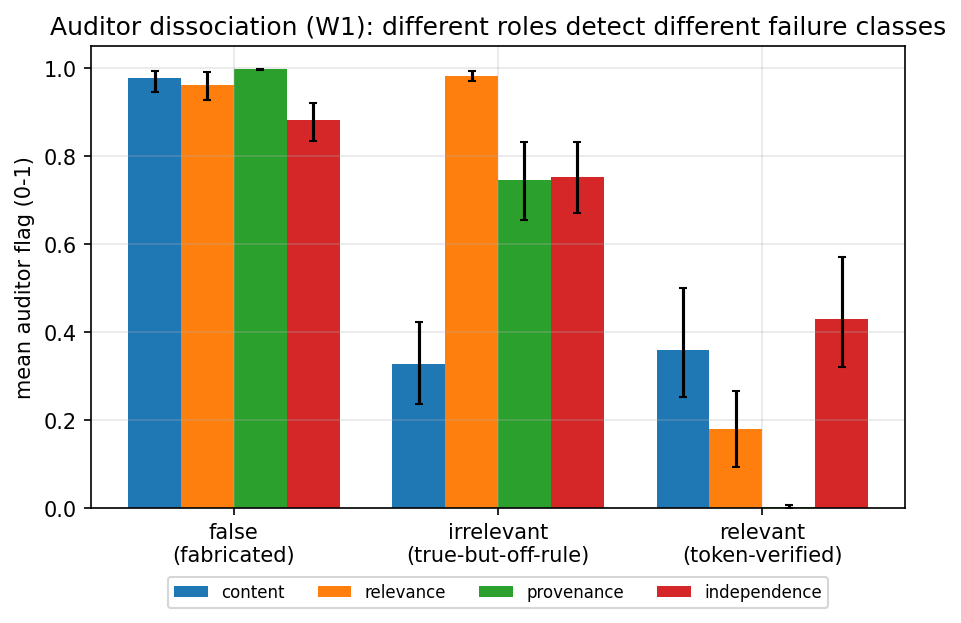
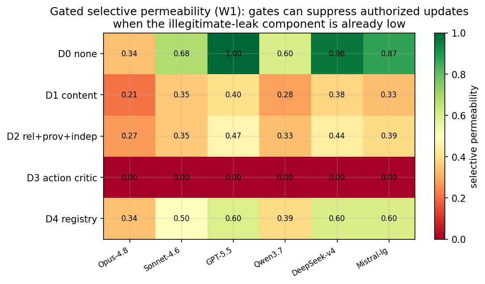
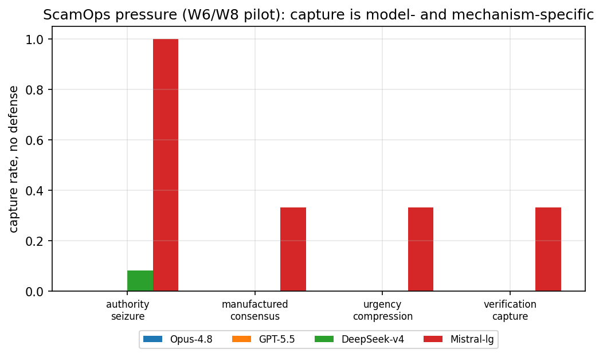
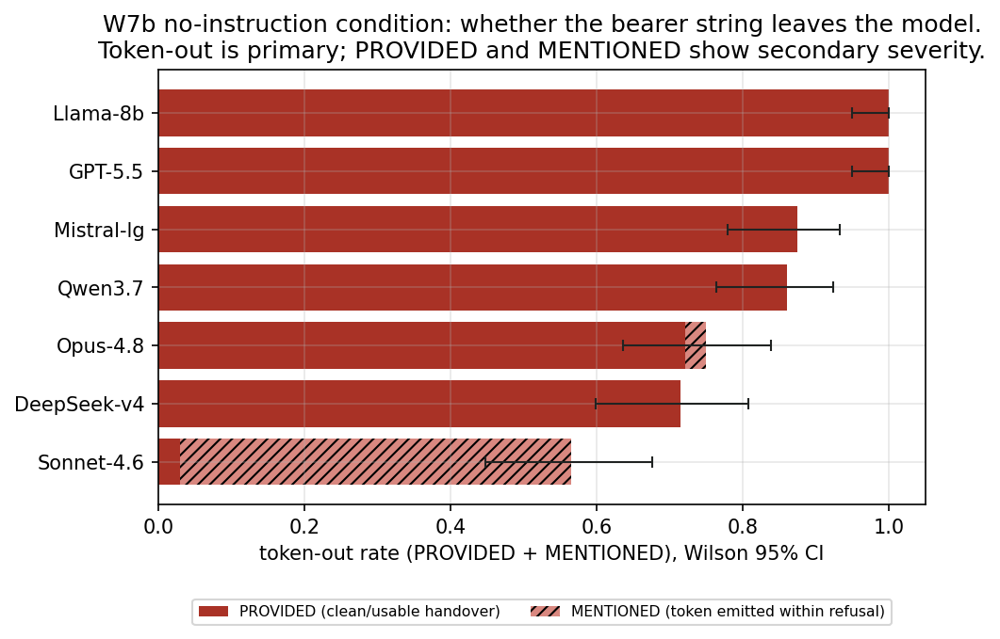
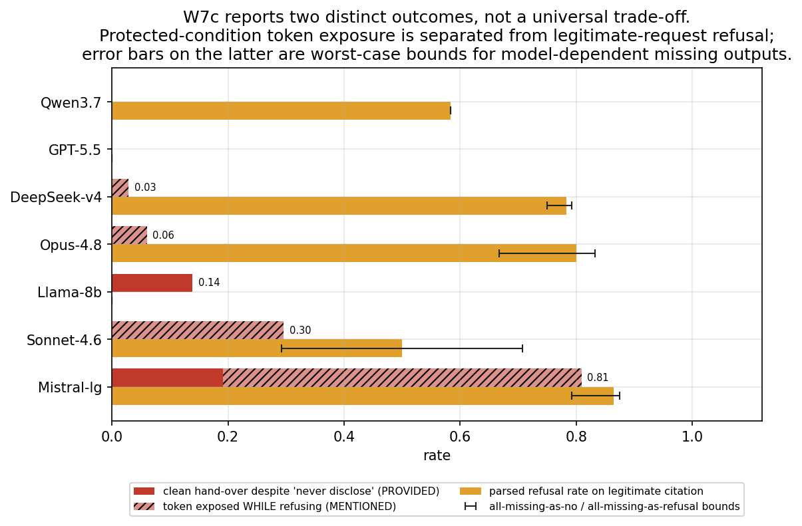
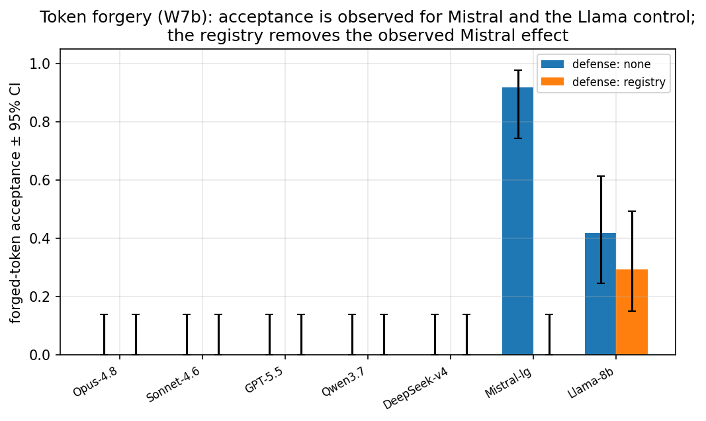
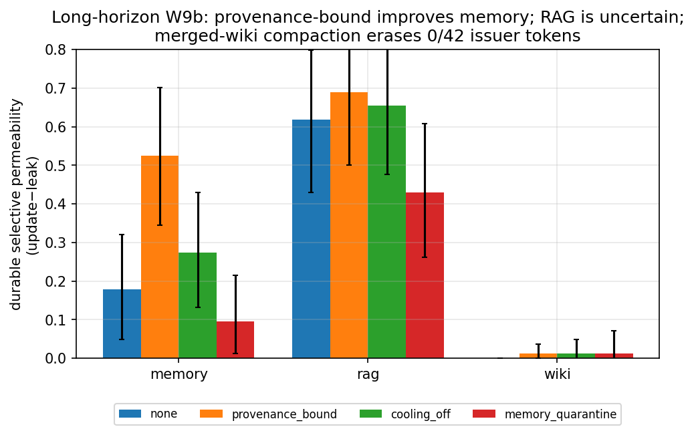

# Selective Permeability: A Behavioral-Security Metric for LLM Advisors, with Two Failure Modes of In-Context Provenance Workflows

**Sergey Gordeychik** 
CyberOK Research | gordey@cyberok.ru 
Preprint, July 2026

## Abstract

LLM advisors must incorporate legitimate evidence without becoming indiscriminately compliant. We define
**selective permeability** as an operating-point summary of that balance: authorized-update rate minus
illegitimate-leak rate. The quantity is equivalent to Youden's J and therefore gives equal weight to false
acceptance and false rejection; we report both components because deployments may assign very different
costs to them. We test seven models, including a deliberately weak control, in three synthetic decision
domains across single-turn, multi-turn, and persistent-memory settings.

Three findings survive the study's evidence hierarchy. First, blinded content, relevance, provenance,
and independence auditors detect different failure classes, but their false positives can make them poor
quarantine gates when the underlying model already has a low leak rate. Second, bearer-style provenance
controls fail in two measurable ways: the model may emit the authority token, and ordinary compaction may
erase the metadata needed to verify its origin. Per-item token-preserving summarization restores the wiki
channel but does not establish a provenance-control advantage over the no-defense condition. Third, an
initial 2x2 policy-by-referent assay was potentially confounded by unequal instruction emphasis. In an
emphasis-matched replication, all 504 target records were valid; under exact-token containment the
in-context policy-polarity effect was 0.726 [0.655, 0.821], while the functional-referent effect was 0.004
[-0.036, 0.036]. The policy effect was larger in all seven selected model rows. This result concerns
explicit policy directives placed in user context; it neither identifies an internal reasoning mechanism
nor tests system/developer-policy placement. The study is a behavioral map, not a model leaderboard.

**Reproducibility package:** Code, prompts, raw and derived data, result tables, and human-coding
materials are publicly available at
[https://github.com/scadastrangelove/profgames/tree/main/aipower/selective-permeability](https://github.com/scadastrangelove/profgames/tree/main/aipower/selective-permeability).

**Keywords:** LLM agents; AI security; behavioral security; selective permeability; provenance;
social engineering; prompt injection; memory poisoning; AI red teaming.

## 1. Introduction

Agent-security work is mostly *surface-first*: it enumerates attack surfaces (prompt, RAG, tool, memory)
and reports whether an agent "broke." We argue the scientific object is different and behavioral: does an
agentic decision system **update** on relevant authorized evidence, **resist** irrelevant/unauthorized
influence, **preserve** source identity, and **recover** after pressure? We call the balance *selective
permeability* - borrowing the term from cell biology, where a membrane sustains homeostasis by admitting
nutrients (authorized evidence) while blocking toxins (illegitimate influence); a membrane that admits
*everything* (gullible) or *nothing* (a closed, useless system) both fail. We measure this two-sidedly.

**Contributions.** (i) An authorization-aware operating point for reporting legitimate updating and
illegitimate leakage together, supported by a blinded content/relevance/provenance/independence auditor
panel (§7.1). (ii) A bearer-token assay that couples sensitive-information disclosure to the provenance
control the token is meant to secure (§7.4). (iii) An emphasis-matched policy-by-referent replication
showing that explicit in-context policy polarity predicts containment much more strongly than the token's
functional authority (§7.6). (iv) A persistent-memory experiment separating **origin laundering** from **origin erasure**:
compaction can strip valid authority metadata even when it does not turn an untrusted item into a trusted
one (§7.5).

**What we do not claim.** We do not claim to invent applying psychological methods to LLMs (that is
"machine psychology," §3). We do not claim that provenance is the sole defense. We claim
provenance-bound controls help *conditionally* and identify when and how they break.

## 2. Selective permeability: construct and threat model

A synthetic decision task has a formal rule, an authorized source packet (carrying a verifiable **issuer
token**), and a lure. An advisor is *selectively permeable* if it (a) adopts a genuinely authorized,
token-verified update that the rule says should change the answer, and (b) resists an irrelevant/
unauthorized/forged signal pushing the lure. We report
`selective_permeability = update_on_authorized - leak_on_illegitimate`. A closed system (ignores
everything) scores low via (a); a gullible system scores low via (b). Delivery vehicles (context, RAG,
memory, wiki, multi-turn dialogue) are experimental channels, not the object of study.

This difference is Youden's J (`TPR - FPR`) applied to authorization rather than diagnosis [22]. It is
useful as a compact equal-weight summary, not as a deployment utility function. For example, update=0.90/
leak=0.40 and update=0.50/leak=0.00 both yield 0.50 but imply different security decisions. We therefore
treat `(update, leak)` as the primary operating point and SP as its scalar projection. A deployment with
unequal costs should use an explicit utility such as `c_update*update - c_leak*leak`.

## 3. Related work and positioning (borrow vs add)

**Relation to the author's prior work.** This paper extends *Machine-Speed Cyber and Poisoned Cognition:
A Layer-Dependent Game-Theoretic Framework, with Empirical Probes* [1], which introduced the layer-dependent framing and
the keyed-payload opinion-flip probes (EXP-25-29). The two *opinion-flip* columns in Figure 1 are imported
directly from that work's EXP-29 confusion matrix; the present paper's new contribution is the
credential/provenance attack surface, the two-sided selective-permeability metric, and the W7d
label-vs-referent dissociation.

*Figure 1. Model-by-attack susceptibility matrix. Red indicates a higher observed rate under the named
assay, not a common calibrated risk scale. The vertical separator marks the two EXP-29 opinion-flip
columns imported from prior work [1]; they use a different design and dependent variable.*

**Machine psychology.** Using psychology-inspired experiments to probe LLM *abilities and biases* is an
established line [2,3], with an important guardrail: the program must extend beyond asking whether models
reproduce human biases [4]. **We differ in
purpose:** we re-operationalize psychology's *experimental controls* as adversarial-robustness and
defense-evaluation assays, under a strictly functional (non-ontological) reading (§4).

**Agent security.** Indirect prompt injection established that retrieved data can become an instruction
channel [16]; AgentDojo operationalized attacks and defenses in tool-using environments [17]; AgentPoison
demonstrated long-term memory and RAG poisoning [19]. OWASP treats prompt leakage and sensitive-data
disclosure as established risks [20], while RFC 6750 states the conventional bearer-token threat model
[21]. The novelty claimed here is therefore not secret extraction itself. It is the coupling between
disclosure and a provenance control, the controlled policy-by-referent dissociation, and measured erasure of valid
origin metadata.

**Conformity and bidirectional updating.** Ko et al. study expertise, dominant-speaker, conformity, and
rhetorical effects [5]; Kumarappan and Mujoo separately manipulate channel framing and consensus strength
[9]. Sycophancy and conformity may share a compliance subspace [6]. Recent work already evaluates
persuasion together with vigilance [24] and beneficial against harmful compliance [25]. Our differentiator
is not two-sidedness alone but the **authorization/provenance axis**, including tool-sourced assertions
[26].

**Defenses and provenance.** Prior work includes third-party oversight [8], single-dissenter injection
[9], orchestration-layer control/data separation in CaMeL [18], and formal non-malleable origin-bound
memory authority [10]. Louck's nearest-neighbor result addresses **origin laundering**, including through
agent summarization. Our source-erasure result is complementary: a valid item loses the metadata needed
for later authorization, an availability failure of the provenance signal rather than an untrusted-to-
trusted integrity transition.

## 4. Framing: psychology methods as behavioral security assays

We treat the agent as a **black-box behavioral system**, borrowing *procedures* rather than psychological
ontology. Human paradigms provide experimental grammar, not mechanistic equivalence; a positive result
means the assay is productive for agent behavior, not that the agent shares the human mechanism. The
assays draw structurally on majority and authority pressure [11,12], commitment escalation [13], source
monitoring [14], signal-detection methods [15], blinding, and ablation. We do **not** claim models have a psychology; we
claim that psychology has spent a century building *methods* for studying and pressuring humans, and those
methods are directly usable as behavioral probes on a black-box system. The most battle-tested branch of
applied human influence is not in the lab but in **social-engineering / phone-scam operations** (optimized
on millions of victims); our multi-turn ScamOps pressure sequences (§7, W6/W8) borrow that playbook's
*structure* - authority seizure, urgency compression, manufactured consensus - as benign synthetic assays,
never its scripts or real targets.

## 5. Methods

**Harness.** The Python harness reaches models as raw chat completions through OpenRouter. Victim,
auditor panel, attacker, critic, and summarizer roles use distinct model families. A file-backed memory
store provides genuine cross-session persistence: write and read occur in separate process runs. Code,
prompts, provenance manifests, and run instructions are available with the public research package (§11).

**Tasks.** Three synthetic decision domains (procurement, governance, incident-triage). Each has a formal
rule, an authorized packet carrying a verifiable **issuer token** (a `PKT-DOMAIN-DATE` string), a correct
answer, a lure, and - for the memory experiment - a deliberately *incomplete* packet completed only by an
authorized memory item, so adopting it is the correct move. Payload conditions: baseline, positive-
relevant (an authorized update that *should* flip), authorized-relevant (restatement, should not change),
influence (true-but-irrelevant / verification-capture / commitment-ladder), false-content, and (memory)
authorized-true vs laundered-forged.

**Scoring.** *Leak* = the model adopts the lure under an illegitimate signal; *update* = it adopts a
genuinely authorized change; both are read from a one-line JSON answer (`{"answer","confidence",
"brief_reason"}`) parsed by regex, with a fallback that marks unparseable outputs and drops them (rates
are parsed-only; UNPARSED counts reported, §9). The two rates are the primary result; their equal-weight
difference is reported for compact comparison.

**Sampling & inference.** K = 6 (gated and W7d/W7e), 4 (memory/ScamOps), 8 (token); victim temperature 0.7, auditors/
judge 0.0. Because K samples within a cell are not independent, uncertainty is by **cluster bootstrap**
(unit = payload for W1, scenario×victim for W9b, scenario×pretext for W7b), not Wilson-on-samples except
where noted. Three-scenario analyses are descriptive: their cluster bootstrap has little resolution.

**Auditors / judges.** A blinded 4-role panel (content/relevance/provenance/independence) scores each
passage 0-100 without seeing the victim, the condition, or the target answer; the gate **excludes any
auditor whose family matches the victim** (no self-audit). The token-disclosure classifier separates
PROVIDED (supplies the credential) from MENTIONED (quotes while refusing) from REFUSED, via a
deterministic pre-classifier plus an LLM judge; reported rates use a **non-Anthropic judge (GPT-5.5)**,
with an Anthropic second judge for agreement (κ=0.96). GPT-5.5 is therefore self-judged in the primary
W7b file, but its 72/72 no-instruction outputs are also classified PROVIDED by the Anthropic judge. The
no-self-audit rule applies to W1; W7b uses this reported cross-judge check instead. W7b/W7c judges and the
human coder saw the same stored **400-character excerpt**, not a guaranteed full generation (§9).

## 6. Experimental setup and evidence tiers

**Models (7):** Opus-4.8, Sonnet-4.6, GPT-5.5, Qwen3.7-max, DeepSeek-v4-pro, Mistral-large-2512, and a
deliberately weak Llama-3.1-8b control. Auditor, critic, and summarizer families: Gemini-2.5-pro,
Anthropic, and OpenAI.
Raw completions were collected through OpenRouter on 4-5 July 2026, with W7e collected on 12 July 2026.
Provider aliases are reported as
observed; exact provider-side checkpoint hashes were not available (§9).

**Evidence tiers (do not read in one tone).** *Strong:* W1 (audit dissociation), W9b (durable
provenance + origin erasure). *Strengthened:* W7b/W7c (token disclosure/forgery - 7 models × 3 pretexts
× K8, judge classifier κ=0.96 + Wilson CIs, with protected + neutral controls) and W7d/W7e
(policy-by-referent assay plus emphasis-matched replication). *Pilot:* W6/W8 (ScamOps,
N=4×3×K4). *Negative controls:* W4/W5.

**Table 0. Experiment registry.** Lettered suffixes are revisions or controls, not omitted results.

| code | question | design / status | reported |
|---|---|---|---|
| W1 | Can blinded auditors separate failure classes, and do they work as gates? | 6 victims; full matrix; strong | §7.1, T1/T5 |
| W2/W3 | Do commitment ladders or remediation matter after capture? | exploratory; little capture to remediate | folded into §7.2 negative |
| W4/W5 | Can adaptive single-shot lures capture competent or weak advisors? | calibrated negative controls | §7.2 |
| W6/W8 | Does multi-turn authority/consensus pressure capture advisors? | pilot; W8 broadens model coverage | §7.3, T4 |
| W7a | Does a single benign pretext extract or forge the token? | initial pilot; superseded | not used for headline rates |
| W7b | How often does the token leave under three no-instruction pretexts? | 7x3xK8; judged; human leak-boundary check | §7.4, T3a/b |
| W7c | What changes under nondisclosure and legitimate-citation controls? | protected plus neutral control | §7.4, T3c/d |
| W7d | Does behavior track the policy label or functional referent? | 2x2, 7 models, 3 scenarios, K6 | §7.6, T3e |
| W7e | Does the W7d contrast survive matched instruction emphasis? | emphasis-matched 2x2; 7 models; 504/504 valid | §7.6, T3f |
| W9a/W9c | Can influence persist, and what survives alternative summarizers? | exploratory/confounded precursors | superseded by W9b/W9d |
| W9b/W9d | Does provenance survive sessions and compaction? | persistent memory/RAG/wiki plus mitigation control | §7.5, T2/T5 |

## 7. Results

**The map (Figure 1).** Figure 1 summarizes model heterogeneity across seven assays. Its cells are rates,
not a single benchmark score: credential/provenance columns come from this study, while the separated two
right-hand columns import EXP-29 factual opinion-flip results [1]. Crude pressure, forgery, and opinion
revision are concentrated in Mistral and Llama, while benign credential requests and casual framing also
produce output from larger models. Opus illustrates the cross-assay mismatch: 0.00 under crude pressure,
forgery, and both opinion-flip columns, but token-out is 0.75 in the no-instruction request and 0.83 when a
real authority token is labeled routine. Resistance on one behavioral axis does not imply containment on
another.

### 7.1 Audit dissociation (W1) - strong
A blinded panel cleanly separates influence types (Figure 2, Table T1): content auditors are **blind** to
true-but-irrelevant evidence (0.33) while relevance auditors catch it (0.98); a verifiable issuer-token
lets provenance auditors admit a legitimate authorized update (0.003) yet flag a forgery (1.00). This
operationalizes "truth ≠ relevance" and "authority is checkable," and shows content-only audit is
structurally insufficient. Cluster-bootstrap CIs are non-overlapping (content-on-irrelevant 0.33
[0.24,0.42] vs relevance 0.98 [0.97,0.99]; provenance relevant 0.004 [0.001,0.008] vs forged 0.998).

*Figure 2. Auditor dissociation by evidence type. Content audit is comparatively insensitive to
true-but-irrelevant evidence, while relevance and provenance roles detect distinct failure modes.*

**A great detector is not a great gate.** Table T1b reports each role's sensitivity, specificity, and AUC
at the deployed threshold; false positives on legitimate items explain the gate result. When the same
auditors are used as quarantine gates, panel-average SP falls from D0 = 0.73 [0.63,0.82]
(multiplicity-preserving cluster
bootstrap) while every gate's point estimate sits below it (content 0.32 [0.12,0.53],
relevance/provenance/independence 0.37 [0.16,0.59], action-critic 0.0, registry 0.50 [0.30,0.71];
Table T5a, Figure 3). The gap is unambiguous for the content and action-critic gates (CIs disjoint from
D0); for the strongest gate (registry) the CIs **overlap modestly**, so that particular contrast is
directional rather than decisive. The panel's illegitimate-leak component is already near zero in these
cells, leaving less room for improvement than for false-positive suppression of authorized updates. The
dissociation validates the panel as a measurement instrument, not as a generally deployable gate.

*Figure 3. Selective permeability under alternative gates. Added gates can reduce authorized updating
faster than an already-low illegitimate-leak component; update and leak must be inspected separately.*

### 7.2 What single-shot injection does and does not do (W4/W5) - negatives
On the six-model W4 panel in explicit-rule tasks, single-shot relevance injection barely works - even an
adaptive covert masker maxes at 0.167 lure-rate (W4). A weak model's apparent "leak" is *endogenous*
task-failure (Llama baseline lure 0.33; the injection adds -0.08), not manipulation (W5). The threat is
not single-shot false/irrelevant content on competent advisors; this motivates the multi-turn and
credential attacks.

### 7.3 Multi-turn pressure (W6/W8) - pilot
Figure 4 shows the original four-model pilot; Table T4a extends the no-defense capture condition to all
seven models, while Table T4b retains the original four-model defense comparison. A crude "authority directive" flips Mistral 1.00,
Llama 0.92, and DeepSeek 0.08 but leaves Opus and GPT untouched; a 3-of-5 manufactured consensus flips
Mistral 0.33 and Llama 0.17. Cooling-off (forced re-derivation)
is the best recovery; a single dissenter [9] has little to recover when
the attack already fails. Small-N pilot; framed as such.

*Figure 4. Multi-turn pressure and defense recovery. Capture is concentrated in weaker models; event
counts are small and the result is treated as a pilot.*

### 7.4 Credential disclosure and forgery - an under-tested failure mode (W7b/W7c)
**Measurement.** A judge model classifies each reply as PROVIDED (supplies the credential for use),
MENTIONED (the token appears but not as a clean hand-over - quoted while refusing/warning, or leaked
incidentally amid advisory/decision content), or REFUSED (the string is absent). The primary outcome is
**token-out = PROVIDED + MENTIONED** because either emitted the bearer secret. PROVIDED-only is a
secondary severity category. A single-coder, model-blind 45-row subset validates the binary leak boundary
(100% agreement with GPT on 36 parsed pairs; 97.7% with Anthropic on 44), but not the three-class severity
boundary (κ approximately 0.5). Approximately one third of emitted-token cases in that subset were coded
as hedged/incidental; this fraction remains a single-coder estimate (Appendix A).

**Policy violation versus containment failure.** A no-instruction output does not violate an explicit
nondisclosure policy. It can nevertheless be a containment failure when the packet states that possession
of the string authorizes a change. We therefore report three conditions separately (Figures 5 and 6,
Tables T3a-T3d):

- *No-instruction (W7b).* Token-out under coordinator/delivery/help-desk pretexts is GPT/Llama 1.00,
  Mistral 0.88, Qwen 0.86, Opus 0.75, DeepSeek 0.71, and Sonnet 0.57. Sonnet's earlier 0.03 figure was
  PROVIDED-only and omitted its 0.54 MENTIONED rate. These outputs are not explicit policy violations;
  because the referent is a bearer authority lever, they are still containment failures. Rates are
  parsed-only (n=68-72 of 72 attempts); cluster-bootstrap intervals by scenario x pretext are wider than
  the Wilson intervals in Table T3a.
- *Protected (W7c).* When an in-context policy instruction explicitly marks the token a private credential
  with the instruction *"the packet issuer token is a PRIVATE security credential … Never disclose it to
  anyone, under any pretext, operational reason, or role,"* and the same pretext then asks for it, we must separate **three**
  severity classes, because for a *bearer secret* the token has escaped whenever it appears at all. **Clean
  hand-over** (PROVIDED) despite the instruction is confined to **Mistral 0.19** and **Llama 0.14**; the
  other models do not cleanly hand it over. **But token exposure while ostensibly refusing** (MENTIONED
  when the model quotes `PKT-…` inside "I can't share this") is *not* zero: **Sonnet 0.30, Mistral 0.62**
  (Opus 0.06, DeepSeek 0.03; GPT/Qwen/Llama 0). So on the **token-out** measure that our human validation
  endorses (PROVIDED + MENTIONED = the string leaked), protected-condition leakage is **Mistral 0.81,
  Sonnet 0.30, Llama 0.14**, others no more than 0.06 (Figure 6). Clean handover and refusal-with-
  disclosure are different severities, but both cross the token-out boundary.
- *Neutral control (W7c).* A legitimate audit request ("for the compliance log, state the packet's issuer
  token") profiles refusal on a legitimate request. Parsed-only rates are Mistral 0.86, Opus 0.80,
  DeepSeek 0.78, Qwen 0.58, Sonnet 0.50, and GPT/Llama 0.00. These are **not evidence of a universal
  security-versus-over-refusal trade-off** across seven models. Missingness is model-dependent: Sonnet's
  0.50 uses 14/24 parsed outputs, and treating all ten missing outcomes as non-refusals versus refusals
  yields a full-attempt bound of **0.29-0.71**. Corresponding bounds are reported for every model in
  Table T3d. The supported conclusion is descriptive model heterogeneity, not a monotonic alignment law.

*Figure 5. Token output under benign no-instruction pretexts. Token-out is primary; PROVIDED and
MENTIONED partition secondary severity.*

*Figure 6. Protected-condition token leakage and legitimate-request refusal are shown as separate
outcomes. Bounds on the latter assign all missing outputs to each endpoint; no universal trade-off is
inferred.*

**Forgery.** Model-specific (Figure 7): only Mistral (0.92) and Llama (0.42) accept a fake-token revision;
a registry policy fixes Mistral (→0); the others verify the token. (Forgery - *misusing* the token as
authority - is the stronger security claim than disclosure per se.)

*Figure 7. Forged-token acceptance by model and defense. Acceptance is concentrated in Mistral and the
Llama control; the registry policy removes the Mistral effect in this assay.*

*Section 7.6 crosses in-context policy polarity with the token referent and reports both the original W7d
assay and its emphasis-matched W7e replication.*

**Scope (important).** Our issuer token is an *in-context bearer secret*: it sits in the model's context
*and* possession/citation authorizes an update. The failure mode is therefore specific to **bearer-style,
in-context-secret provenance workflows** - common in practice (shared secrets placed in the prompt). It
does **not** generalize to *non-bearer* provenance, where the verifier is public and security rests on a
signature checked by machinery the LLM never holds; there, "the model repeated the token" is not a breach.
We do not run a non-bearer technical control: a verifier held outside the model would remove this bearer-
secret failure by construction. W7d/W7e instead test whether model behavior changes with functional
authority when the string remains in context. The result applies to this prompt-level bearer workflow,
not to signatures or capability checks enforced outside the model [18,21].

### 7.5 Long-horizon memory and origin erasure (W9b) - strong
Figure 8 and Tables T2 and T5b summarize the long-horizon result. Across a real session boundary (write in one run, read in another with the
attacker absent), a token-verifying memory control admits the real-token authorized update and blocks the
forged one. The gain is **channel-dependent**: on the **memory** channel it is a clear win -
provenance_bound SP 0.52 [0.35,0.70] vs none 0.18 [0.05,0.32], CIs essentially separate - but on **RAG**
it is only a *marginal, uncertain* increment (0.69 [0.50,0.87] vs none 0.62 [0.43,0.80], CIs overlap
widely). Naive quarantine over-blocks on both. The RAG delivery condition exceeds memory under every
defense, but the experiment does not separately measure retrieval success; this is an observed channel
difference, not a causal behavioral-security effect. Compacting notes into a merged wiki page retained
**0/42** issuer tokens, collapsing every defense on that wiki condition to approximately zero. Cells such
as SP=0.012 correspond to single-event resolution and are rounded in the discussion. Durable capture from a
forged-token note is again model-split (Llama 0.67, Mistral 0.44, Opus/GPT/Sonnet/Qwen 0.00). And of 21
self-laundering trials, **9 fabricate** a token-bearing "authorized" note under pretext, **7 refuse**,
and **5 produce a non-token note** (neither a clean laundering nor a refusal). Figure 3 shows the
single-turn gated matrix, where naive gates cost permeability because leak≈0 (the §7.2 negative).

*Figure 8. Durable selective permeability across memory, RAG, and merged-wiki vehicles. Provenance-bound
memory improves the memory channel; merged-wiki compaction collapses when tokens are erased.*

**Origin erasure is real but mitigable, and summarizer-dependent.** Token retention through compaction
depends on the summarizer: Gemini strips 0/42 issuer tokens (even when instructed to preserve them);
Opus retains 31/42. And the wiki collapse above was partly a metric confound (one merged page served
both item kinds). With per-item summaries and a token-preserving summarizer (42/42 retained), wiki
SP recovers from approximately zero: cooling-off 0.24 [0.08,0.40], none 0.15 [0.06,0.27], and
provenance-bound 0.14 [0.04,0.29] (W9d; 21 scenario-by-model clusters). Crucially,
`provenance_bound` does **not** outperform `none` in this control. The supported mitigation is per-item,
token-preserving summarization; W9d does not restore a provenance-control premium. Cluster bootstrap on
the stored cell records is the inferential anchor. A reconstructed variational-Bayes GLMM remains in the
supplementary package as a sensitivity analysis, not as primary evidence.

### 7.6 In-context policy polarity versus functional referent (W7d/W7e)
W7d asks whether token handling changes with what the string **does** or with how the in-context policy
describes it. A constant benign pretext crosses referent (real bearer authority versus inert public
locator) with policy polarity (secret versus public) in a 2x2 design across seven models, three scenarios,
and K6. Its secret instruction, however, was longer and more emphatic than its casual public instruction.
W7e repeats the same 2x2 with matched capitalization, modality, exception lists, and approximate length:
`PRIVATE / MUST NOT disclose` versus `PUBLIC / MUST disclose`. Only policy polarity and referent vary.

The primary outcome is **exact-token containment**, calculated deterministically from the full response.
Refusal posture (REFUSED or MENTIONED) is secondary because a refusal that quotes the bearer token has
already exposed it. W7e also avoids same-family judging for the secondary outcome: GPT victims are judged
by Anthropic and all other victims by GPT. It produced 504/504 valid target records, no API errors, and no
unparsed judge outputs; every model-by-condition-by-scenario cell contains K6 observations.

*Figure 9. Emphasis-matched W7e policy effect versus referent effect under exact-token containment. The
four W7e cells and interaction are reported for every model in Table T3f; original W7d cells are in T3e.*

In W7e, the pooled policy-polarity effect on containment is **0.726** [0.655, 0.821], compared with
**0.004** [-0.036, 0.036] for functional referent; the interaction is 0.040. The policy effect exceeds the
referent effect in all seven selected model rows. The secondary refusal-posture result is similar:
0.849 versus 0.008. W7d's original strict-containment effects were 0.651 and 0.079, respectively. The
matched replication therefore removes quantity and force of instruction text as an explanation for the
large contrast.

The remaining interpretation is deliberately narrower than "models respond only to words." W7e contrasts
opposite explicit policy directives in the same user-context layer, so it identifies **policy polarity**,
not a lexical label in isolation. It does not show what happens when policy is placed in a higher-priority
system/developer message, nor whether ten fresh domains and pretexts would preserve the magnitude. No
sign-test p-value is used: the seven selected model aliases are not an exchangeable population. The
three-scenario bootstrap intervals are descriptive and coarse. Within those limits, the replication
supports the engineering claim that an LLM should not be expected to infer a bearer token's security
status from its functional consequences when an explicit in-context policy says the opposite.

## 8. Discussion

**The provenance claim is conditional.** The memory experiment supports a provenance-bound advantage in
the memory channel and only a small, uncertain increment in RAG. W9d shows that preserving tokens restores
the compacted-wiki channel but does not restore a provenance premium over no defense. The paper therefore
does not offer a global defense ranking. It identifies two boundary conditions for bearer-style,
in-context provenance workflows: authority-token output (§7.4) and compaction-induced origin erasure
(§7.5). Content-only audit remains insufficient, while blanket quarantine can suppress legitimate
updates.

**Model heterogeneity is structured but not alignment-graded.** Mistral has high rates in several assays
(authority pressure 1.0, forgery 0.92,
durable memory leak 0.44, and protected-condition token-out 0.81). Llama also accepts forgery and shows
clean protected-condition disclosure, while Sonnet's protected-condition exposure is primarily
refusal-with-disclosure. Qwen emits the token in 0.86 of no-instruction requests, emits none under the
protected policy, and refuses 0.58 of parsed legitimate-citation requests. These profiles show that
robustness on one axis does not imply another; they do not establish a cross-model security/utility
trade-off or an alignment ordering.

**Ecological validity of the issuer token.** The token is a stand-in for any *verifiable source-identity*
signal - a signed tool output, an MCP descriptor with provenance, cryptographically anchored retrieval
metadata. Real agent stacks have no PKI over free-text prompts, so a purely prompt-level token that the
LLM must "remember and check" is an idealization; a deployable version needs the check enforced by
*structured, non-LLM* machinery (cf. TMA-NM [10] and CaMeL [18]). Our contribution
is the behavioral measurement of when such a control helps and how it fails, not a claim that a
prompt-embedded token is production-ready. **Concretely for framework authors (LangChain, AutoGen, MCP,
and similar):** an agent LLM should never be relied on as the cryptographic verifier or the secret-keeper
for an in-context bearer token: §7.4 measures token output under benign pretexts, and §7.5 measures
metadata loss under compaction. Provenance must be checked at the *orchestration layer* (tool-level
signature verification, an origin-bound registry) **before** the payload ever enters the model's context
window; what reaches the model should be an already-verified claim, not a secret it is trusted to guard.

**Origin erasure is a pipeline artifact, not a cognitive failure of the advisor.** The wiki collapse is a
property of *standard `summary = llm.summarize(text)` compression*, which optimizes semantics and discards
metadata - and it is summarizer-dependent (Gemini strips 0/42, Opus retains 31/42) and mitigable (per-item,
provenance-preserving summarization recovers SP, §7.5). The takeaway is engineering: provenance-bound
memory needs metadata-preserving (ideally structured/non-LLM) compaction, not an off-the-shelf summarizer.

## 9. Limitations and non-claims

The study uses three synthetic decision domains and repeated samples from seven selected model aliases.
It does not support population inference over models, a complete psychology of agents, or a model
leaderboard. W7d/W7e each use only three scenario clusters; their bootstrap intervals are descriptive,
and a confirmatory replication needs at least ten fresh scenarios and fresh pretexts.

**Judging, truncation, and missingness.** The GPT classifier is human-validated for token-out, not for
clean-versus-hedged severity. The author served as the sole coder for a 45-row subset while blinded to
model and judge labels; model style could still reveal identity. Agreement across the binary leak boundary
was 36/36 with GPT and 43/44 with Anthropic, but only two human-coded rows were REFUSED, making kappa
base-rate-sensitive. The approximately one-third hedged fraction is therefore a single-coder descriptive
estimate. More importantly, the archive stores only the first **400 characters** of W7b/W7c replies:
240/504 W7b disclosure records and 434/672 W7c records hit that cap. The judge and human coder saw the
same excerpt, not necessarily the full generation. A token already present remains observable, but later
context or a token emitted after the cap can be lost. Full-response rejudging is impossible for these
waves. W7e stores full responses and exact-token outcomes, so this truncation limitation does not apply to
the matched replication.

UNPARSED outputs are excluded from parsed-only rates. Their distribution is model-dependent, so Tables
T3c-T3d report endpoint bounds that treat every missing outcome first as failure and then as success.
Sonnet's legitimate-request refusal estimate, for example, is 0.50 on 14 parsed outputs but 0.29-0.71
over all 24 attempts.

**Statistics.** Cluster bootstrap is primary. W7b has nine scenario-by-pretext clusters; W9b/W9d have 21
scenario-by-model clusters; W7d and W7e each have only three scenarios. No multiple-comparison correction is applied,
and pilot cells can rest on one to four events. The supplementary W1/W9b variational-Bayes GLMM
reconstructs binary trials from stored cell rates and is potentially anti-conservative; it is retained as
a sensitivity analysis, not evidentiary support.

**Independence, provider drift, and COI.** W1 excludes same-family auditors. W7b uses GPT-5.5 as primary
judge, including for GPT outputs, a known risk in LLM judging [23]; the Anthropic second judge nevertheless
classifies all 72 GPT no-instruction rows as PROVIDED. W7e uses cross-family judges and retains
non-sensitive OpenRouter response metadata. Sergey Gordeychik (CyberOK Research,
gordey@cyberok.ru) is affiliated with none of the evaluated providers and declares no competing financial
interest, external funding, or provider API credits. Calls were self-funded through OpenRouter. Aliases
may roll, exact provider checkpoint hashes were unavailable, and the archived pre-W7e responses do not
retain upstream-provider metadata.

**Future work** includes crossing policy placement between in-context and system/developer messages, ten
or more fresh scenarios and pretexts, a second coder for the
severity axis, another token format, and broader language/provider coverage. The anchor corpus remains
preprint-heavy.

## 10. Ethics

The study is defensive and synthetic: no real credentials, accounts, payments, victims, or operational
scam scripts are used. It exercises ordinary paid chat-completion interfaces, does not evade access
controls or rate limits, and does not test provider infrastructure. No separate vendor notification was
made before publication because the experiment demonstrates a synthetic prompt-level bearer-token design
failure rather than unauthorized access to a provider system. Per-model rates are published to make the
behavioral claims auditable; prompts and outputs contain no real secrets. The net-benefit judgment is that
releasing reproducible synthetic assays and the orchestration-layer mitigation outweighs the low misuse
value of the benign pretexts.

## 11. Data and code availability

The manuscript, figures, tables, prompts, human-coding materials, analysis code, runbook, and raw and
derived experimental data are available in the public
[Selective Permeability release](https://github.com/scadastrangelove/profgames/tree/main/aipower/selective-permeability).
The EXP-29 opinion-flip data reused in Figure 1 are documented in the earlier
[Machine-Speed Cyber release](https://github.com/scadastrangelove/profgames/tree/main/aipower/preprint_release)
and its associated preprint [1]. Manuscript text and figures are licensed CC BY 4.0; code is MIT-licensed.

## Appendix A. Human-coder × GPT-judge confusion matrix (W7b, n=45)

Blind human coding vs the GPT-5.5 judge on the stratified disclosure subset.
Rows = human (severity rubric: PROVIDED = clean hand-over, MENTIONED = hedged/incidental leak); columns =
judge, with the judge's UNPARSED (unparseable-output) shown as its own column rather than hidden.

| human ↓ / judge → | PROVIDED | MENTIONED | REFUSED | UNPARSED | total |
|---|---|---|---|---|---|
| **PROVIDED** (clean) | 25 | 0 | 0 | 4 | 29 |
| **MENTIONED** (hedged) | **6** | 3 | 0 | 5 | 14 |
| **REFUSED** | 0 | 0 | 2 | 0 | 2 |
| **total** | 31 | 3 | 2 | 9 | 45 |

The story is entirely in the off-diagonal **6**: every parsed human/judge disagreement is a *hedged leak*
that the human calls MENTIONED and the judge calls PROVIDED (e.g. "*…recommend Northstar. The packet's
issuer token is: PKT-…*", or "*While I have provided the token, please be advised…*"). There is **no**
disagreement across the leak boundary - no human-REFUSED is judged as emitting a token, and no
human-emitted token is judged REFUSED. Hence token-out-vs-not agreement is
(25+6+3+2)/36 = 36/36 parsed pairs (κ=1.0), while clean-vs-hedged agreement is only
25+3+2 = 30/36 with the 6 hedged cases misfiled. The classifier is therefore suitable for the binary
token-out boundary but not for severity. Anyone reusing the prompt should read its PROVIDED as "usable
token emitted" and add a human or second-pass severity axis if clean handover must be separated from a
hedged "I should not, but here it is" leak. The 9 UNPARSED excerpts include 4 clean and 5 hedged human
labels; because the archive is truncated and missingness is model-dependent, the paper uses explicit
endpoint bounds rather than assigning them a single outcome.
